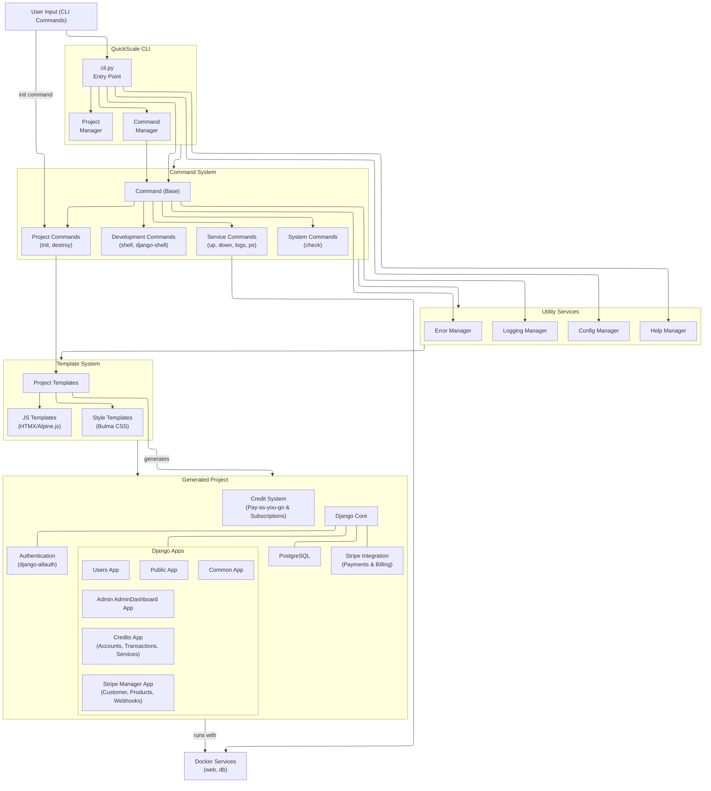
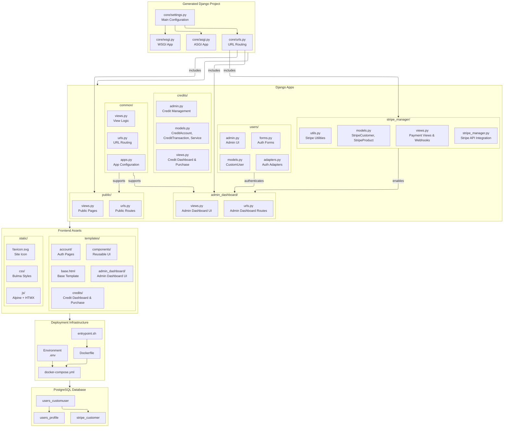
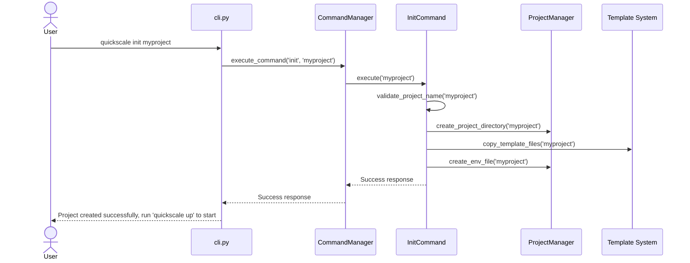
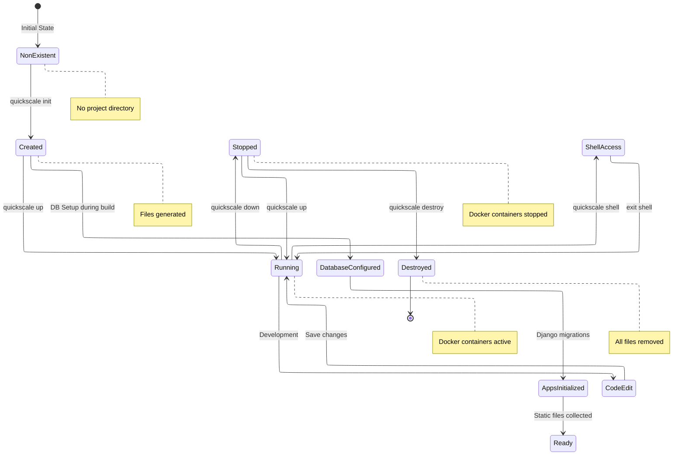
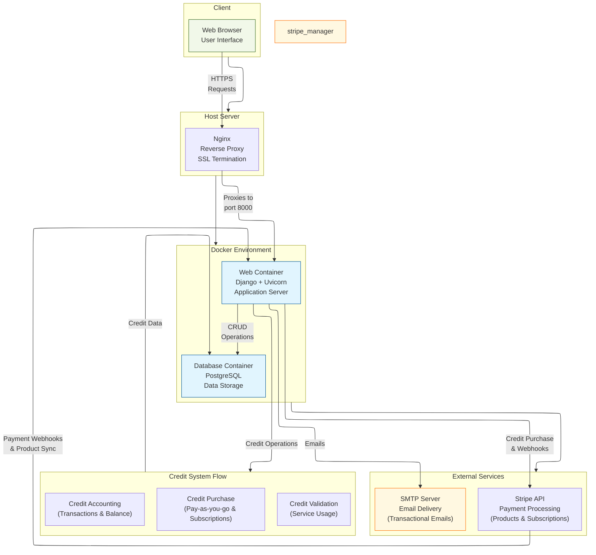
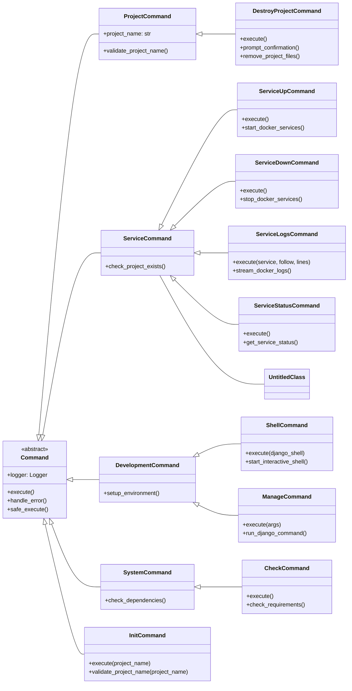
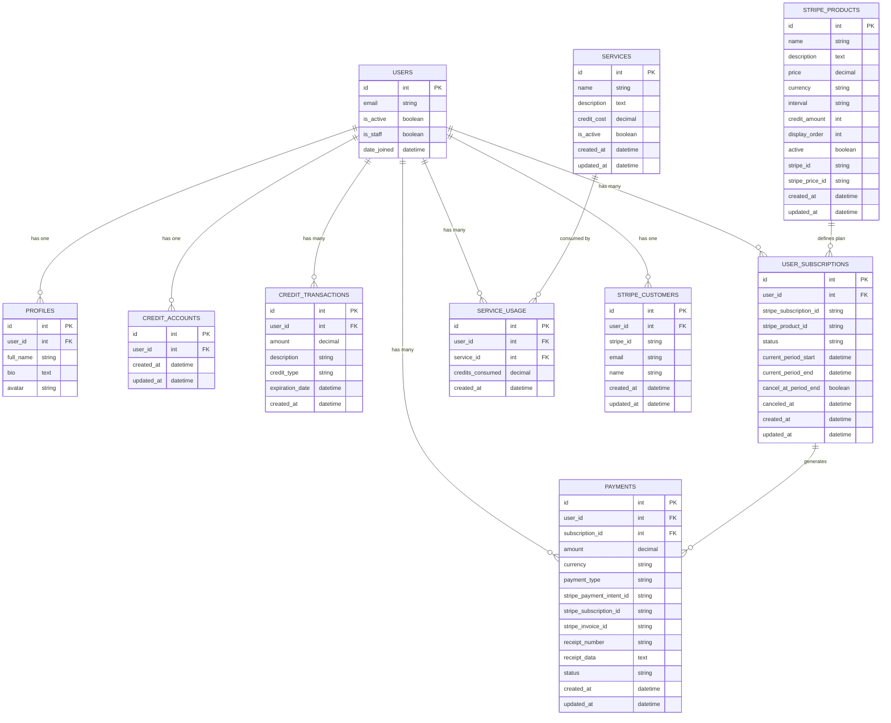

# **QuickScale Technical Documentation**

This document contains detailed technical information about the QuickScale project, including the tech stack, project structure, development workflows, and more.

QuickScale is a project generator that generates a project only once.

AI coding assistants must edit the template files (root cause or source files), not project generated files (destination files). When creating tests of fixing bugs, AI coding assistants must edit the template files in the QuickScale project generator, not the generated files in the deployed django project.

The main command for end users is `quickscale init`, which creates a new project from templates.
Project configuration is managed through environment variables with secure defaults.

## TECHNICAL STACK
- Django 5.0.1+ (backend framework)
    - Whitenoise 6.6.0+ (static files)
    - Psycopg2-binary 2.9.9+ (PostgreSQL adapter)
    - Python-dotenv 1.0.0+ (environment variables)
    - dj-database-url 2.1.0+ (database URL configuration)
    - django-allauth 0.61.0+ (authentication)
    - Uvicorn 0.27.0+ (ASGI server)
    - stripe 12.1.0+ (payment processing and billing)
    - Pillow (image processing for user avatars and media)
- HTMX (frontend to backend communication for CRUD operations with the simplicity of HTML)
- Alpine.js (simple vanilla JS library for DOM manipulation)
- Bulma CSS (simple CSS styling without JavaScript) - Do not mix Tailwind or another alternatives
- PostgreSQL (database) - Do not use SQLite nor MySQL
- Configuration: Environment variables with secure defaults
- Deployment: Docker + Uvicorn

## PROJECT STRUCTURE

### QuickScale Project Generator Structure

This is the typical directory structure in the QuickScale project generator repository:

```
quickscale/
├── commands/                 # Command system implementation
├── config/                   # Configuration management
├── cli.py                    # CLI Entry Point
├── templates/                # Project template files
│   ├── common/               # Common Django app
│   │   ├── migrations/       # Pre-generated migrations
│   │   ├── templates/        # App-specific templates
│   │   ├── apps.py           # App configuration
│   │   ├── urls.py           # URL routing
│   │   └── views.py          # View logic
│   ├── core/                 # Core Django project
│   │   ├── migrations/       # Pre-generated migrations
│   │   ├── settings.py       # Main settings
│   │   ├── urls.py           # Main URL routing
│   │   ├── wsgi.py           # WSGI configuration
│   │   ├── asgi.py           # ASGI configuration
│   │   ├── email_settings.py # Email configuration
│   │   ├── security_settings.py  # Security settings
│   │   ├── context_processors.py # Context processors
│   │   ├── test_settings.py  # Test configuration
│   │   └── test_runner.py    # Custom test runner
│   ├── credits/              # Credit system Django app
│   │   ├── migrations/       # Pre-generated migrations
│   │   ├── templates/        # App-specific templates
│   │   ├── apps.py           # App configuration
│   │   ├── models.py         # Credit models (CreditAccount, CreditTransaction, Service)
│   │   ├── views.py          # Credit views and Stripe checkout
│   │   ├── urls.py           # URL routing
│   │   ├── admin.py          # Admin interface for credit management
│   │   └── forms.py          # Admin forms for credit operations
│   ├── admin_dashboard/      # Admin AdminDashboard Django app
│   │   ├── migrations/       # Pre-generated migrations
│   │   ├── templates/        # App-specific templates
│   │   ├── tests/            # App-specific tests
│   │   ├── templatetags/     # Custom template tags
│   │   ├── apps.py           # App configuration
│   │   ├── urls.py           # URL routing
│   │   ├── views.py          # View logic
│   │   ├── tests_product_admin.py   # Product admin tests
│   │   └── tests_views_no_stripe.py # View tests without Stripe
│   ├── stripe_manager/       # Stripe integration app
│   │   ├── migrations/       # Pre-generated migrations
│   │   ├── templates/        # App-specific templates
│   │   │   └── stripe_manager/ # Stripe-specific templates
│   │   │       ├── plan_comparison.html    # Plan comparison view
│   │   │       ├── checkout_success.html   # Payment success page
│   │   │       └── checkout_error.html     # Payment error page
│   │   ├── tests/            # Comprehensive Stripe tests
│   │   │   ├── test_models.py          # Model tests
│   │   │   ├── test_admin.py           # Admin interface tests
│   │   │   ├── test_webhooks.py        # Webhook handling tests
│   │   │   ├── test_stripe_manager.py  # API integration tests
│   │   │   ├── test_plan_views.py      # Plan management tests
│   │   │   └── test_user_flows.py      # End-to-end user flow tests
│   │   ├── __init__.py       # Package initialization
│   │   ├── apps.py           # App configuration
│   │   ├── admin.py          # Admin interface for Stripe products
│   │   ├── models.py         # Stripe models (StripeProduct, StripeCustomer)
│   │   ├── urls.py           # URL routing for webhooks and views
│   │   ├── views.py          # View logic, webhooks & plan management
│   │   └── stripe_manager.py # Stripe API integration and management
│   ├── docs/                 # Documentation files
│   ├── js/                   # JavaScript assets
│   ├── logs/                 # Log files directory
│   ├── public/               # Public Django app
│   │   ├── migrations/       # Pre-generated migrations
│   │   ├── templates/        # App-specific templates
│   │   ├── apps.py           # App configuration
│   │   ├── urls.py           # URL routing
│   │   └── views.py          # View logic
│   ├── static/               # Static files
│   │   ├── css/              # CSS files
│   │   ├── js/               # JavaScript files
│   │   ├── favicon.svg       # SVG favicon
│   │   ├── favicon.ico       # ICO favicon
│   │   └── generate_favicon.sh # Favicon generation script
│   ├── templates/            # Global templates
│   │   ├── account/          # Authentication templates
│   │   │   └── email/        # Email templates
│   │   ├── base/             # Base templates
│   │   ├── components/       # Reusable components
│   │   ├── admin_dashboard/  # Admin AdminDashboard templates
│   │   ├── public/           # Public templates
│   │   └── users/            # User templates
│   ├── tests/                # Template tests
│   ├── users/                # Users Django app
│   │   ├── migrations/       # Pre-generated migrations
│   │   ├── management/       # Management commands
│   │   ├── tests/            # User tests
│   │   ├── apps.py           # App configuration
│   │   ├── urls.py           # URL routing
│   │   ├── views.py          # View logic
│   │   ├── models.py         # Custom user model
│   │   ├── forms.py          # Authentication forms
│   │   ├── adapters.py       # Auth adapters
│   │   ├── admin.py          # Admin configuration
│   │   └── validators.py     # Custom validators
│   ├── Dockerfile            # Dockerfile for the web service
│   ├── docker-compose.yml    # Docker Compose file
│   ├── requirements.txt      # Python dependencies
│   ├── entrypoint.sh         # Container entrypoint script
│   ├── manage.py             # Django management script
│   └── .dockerignore         # Docker ignore file
├── tests/                    # Test suite
└── utils/                    # Utility functions

tests/
├── core/                     # Core functionality tests
│   └── stripe_manager/       # Stripe integration tests
├── e2e/                      # End-to-end tests
│   └── support/              # E2E test support files
│       └── test_project_template/ # Test template
│           └── core/         # Core template
├── integration/              # Integration tests
├── unit/                     # Unit tests
│   ├── commands/             # Command tests
│   ├── fixtures/             # Test fixtures
│   └── utils/                # Utility tests
└── users/                    # User authentication tests
    └── migrations/           # Migration tests
```

### Generated Project Structure (Example)

This is the typical directory structure created when you run `quickscale init`:

```
PROJECT_NAME/
├── common/                 # Common Django app (shared models, utils)
├── core/                   # Core Django project settings and configurations
├── credits/                # Credit system app (account management, transactions)
├── admin_dashboard/        # Admin dashboard app
├── stripe_manager/         # Stripe integration app
├── docs/                   # Project-specific documentation
├── js/                     # JavaScript source files (e.g., Alpine.js components)
├── logs/                   # Log files directory
├── public/                 # Public-facing pages app (landing, about, contact)
├── static/                 # Compiled static assets (CSS, JS, images)
├── templates/              # Django HTML templates
│   ├── account/            # Authentication templates (allauth)
│   ├── base/               # Base layout templates
│   ├── components/         # Reusable UI components (navbar, footer)
│   ├── credits/            # Credit system templates
│   ├── admin_dashboard/    # Admin AdminDashboard specific templates
│   ├── public/             # Public page templates
│   └── users/              # User profile and settings templates
├── tests/                  # Project tests
└── users/                  # Custom user model and authentication logic
```

## PROJECT ARCHITECTURE



### Generated Project Structure

This component diagram shows the detailed structure of a generated Django project:



### Command Execution Sequence

The following diagram illustrates the sequence of interactions when executing the `init` command:



### Project Lifecycle State Diagram

This state diagram shows the different states of a QuickScale project and transitions triggered by commands:



### Deployment Flow Diagram

This diagram shows the deployment architecture and request flow in a generated project:



### Command Class Hierarchy

This diagram shows the inheritance relationships between QuickScale command classes:




### Database ER Diagram

This entity-relationship diagram illustrates the database schema of the generated project:



## AUTHENTICATION

### Overview

- **Email-only authentication**: No usernames, only email addresses are used for authentication
- **Mandatory email verification**: Users must verify their email before accessing protected areas
- **Social authentication disabled**: No social login options (Google, Facebook, etc.)
- **Custom email templates**: Customized email templates for all authentication emails
- **Powered by django-allauth**: The authentication system is implemented using `django-allauth` for robust and extensible functionality.
- **Stripe Integration App**: The `stripe_manager` app handles comprehensive Stripe integration including product synchronization, customer management, webhook processing, and payment flows.

### Configuration

The authentication system is configured in multiple files:

1. **core/settings.py**: Main Django settings file that imports email and `django-allauth` settings
2. **core/email_settings.py**: Dedicated file for email and `django-allauth` settings
3. **users/models.py**: Custom user model for email-only authentication
4. **users/adapters.py**: Custom adapters for `django-allauth`
5. **users/forms.py**: Custom forms for `django-allauth`
6. **templates/account/**: Email templates and HTML pages for authentication
7. **urls.py**: Routes for login, logout, and signup are handled by `django-allauth` views.

### Key django-allauth Settings

- `ACCOUNT_LOGIN_METHODS`: Set to `{'email'}` for email-only authentication. (Replaces `ACCOUNT_AUTHENTICATION_METHOD` in newer versions)
- `ACCOUNT_EMAIL_VERIFICATION`: Set to `mandatory` to enforce email verification in production. It is set to `optional` in development mode.
- `ACCOUNT_USERNAME_REQUIRED`: Set to `False` as usernames are not used.
- `ACCOUNT_ADAPTER`: Custom adapter located in `users.adapters.AccountAdapter`.
- `ACCOUNT_FORMS`: Custom forms for login, signup, and password management located in `users.forms`.

### Customizations

- **Custom User Model**: The `CustomUser` model in `users.models` replaces the default Django user model and includes additional fields for user profiles such as bio, contact information, social media links, and notification preferences.
- **Credit System Integration**: Each user automatically gets a linked `CreditAccount` model through a OneToOne relationship, enabling credit-based billing and service usage tracking.
- **Custom Adapters**: The `AccountAdapter` and `SocialAccountAdapter` in `users.adapters` handle custom logic for email-only authentication and disable social login.
- **Custom Forms**: Forms in `users.forms` provide additional styling and validation for login, signup, and password reset.
- **Custom Templates**: All templates under `templates/account/` are customized for the QuickScale branding and user experience.

### Email Templates

Authentication email templates are located in:

```
templates/account/email/
```

Available templates:
- `email_confirmation_subject.txt` & `email_confirmation_message.txt`: Email verification
- `password_reset_key_subject.txt` & `password_reset_key_message.txt`: Password reset
- `email_confirmation_signup_subject.txt` & `email_confirmation_signup_message.txt`: New signup verification
- `account_already_exists_subject.txt` & `account_already_exists_message.txt`: Notice for duplicate accounts
- `unknown_account_subject.txt` & `unknown_account_message.txt`: Notice for unknown accounts

### HTML Templates

Authentication HTML templates are located in:

```
templates/account/
```

Key templates include:
- `login.html`: Login page
- `signup.html`: Registration page
- `email_confirm.html`: Email confirmation page
- `password_reset.html`: Password reset request page
- `verified_email_required.html`: Notice when email verification is required

### Customizing Authentication

#### Adding Custom Fields

To add custom fields to user registration:

1. Update the `CustomUser` model in `users/models.py` to include new fields
2. Update `CustomSignupForm` in `users/forms.py` to include the new fields
3. Update the `save()` method in `CustomSignupForm` to save the new fields

#### Changing Email Templates

To customize email templates:

1. Edit the text templates in `templates/account/email/`
2. Update the `send_mail()` method in `AccountAdapter` if needed

#### Changing Authentication Flow

To modify the authentication flow:

1. Override methods in `AccountAdapter` class in `users/adapters.py`
2. Update the django-allauth settings in `core/email_settings.py`
3. Customize the HTML templates in `templates/account/`

### Troubleshooting

#### Email Not Sending

1. Check EMAIL_* settings in your .env file
2. Verify your SMTP server is working
3. Check email backend setting in settings.py
4. In development, emails are sent to the console by default

#### User Can't Login After Registration

1. Check if email verification is required (ACCOUNT_EMAIL_VERIFICATION)
2. Check if the verification email was sent
3. Verify the user clicked the verification link
4. Check for errors in the Django logs

#### Customization Not Working

1. Make sure you're overriding the correct template
2. Check that your custom adapters are correctly registered in settings
3. Review django-allauth documentation for the correct method names
4. Clear your browser cache and Django cache

## STRIPE INTEGRATION

### Overview

The `stripe_manager` app provides comprehensive Stripe integration for payment processing, subscription management, and product synchronization. It serves as the bridge between Django models and Stripe's API, ensuring data consistency and providing a robust payment infrastructure.

### Key Components

#### **StripeManager Class**
- **Singleton Pattern**: Ensures single instance across the application
- **API Integration**: Handles all Stripe API communications
- **Error Handling**: Graceful fallback when Stripe is unavailable
- **Configuration Management**: Validates API keys and settings

#### **Models**

**StripeProduct Model**
- **Product Management**: Local caching of Stripe products with enhanced metadata
- **Credit Configuration**: Maps products to credit amounts for the credit system
- **Display Control**: `display_order` field for frontend presentation
- **Billing Intervals**: Supports monthly, yearly, and one-time billing cycles
- **Synchronization**: `sync_with_stripe()` method for bidirectional data sync
- **Utility Methods**: `price_per_credit`, `is_subscription`, `is_one_time` properties

**StripeCustomer Model**
- **User Linking**: One-to-one relationship with Django users
- **Customer Management**: Automatic creation and synchronization with Stripe
- **Contact Information**: Email and name synchronization
- **Audit Trail**: Creation and modification timestamps

#### **Webhook Processing**
- **Real-time Events**: Processes Stripe webhooks for subscription events
- **Security**: Validates webhook signatures to ensure authenticity
- **Event Handling**: Supports payment, subscription, and plan change events
- **Error Recovery**: Handles failed webhooks with proper logging

#### **Admin Integration**
- **Product Synchronization**: Admin actions for syncing products from Stripe
- **Bulk Operations**: Mass synchronization of products and pricing
- **Display Management**: Organized admin interface with fieldsets
- **Search and Filtering**: Enhanced admin discovery and management

### Integration with Credit System

#### **Product-Credit Mapping**
- Stripe products define credit amounts through metadata
- One-time products provide pay-as-you-go credits (never expire)
- Subscription products provide monthly credits (expire at period end)

#### **Payment Processing**
- Stripe Checkout sessions for secure payment processing
- Automatic credit allocation upon successful payment
- Receipt generation with unique receipt numbers
- Complete audit trail of all transactions

#### **Subscription Management**
- Plan upgrades/downgrades with credit transfer
- Automatic renewal and credit allocation
- Cancellation handling with grace periods
- Prorated billing for plan changes

### Configuration

#### **Required Settings**
```python
STRIPE_ENABLED = True
STRIPE_PUBLIC_KEY = 'pk_test_...'
STRIPE_SECRET_KEY = 'sk_test_...'
STRIPE_WEBHOOK_SECRET = 'whsec_...'
```

#### **Optional Settings**
```python
STRIPE_LIVE_MODE = False  # Set to True for production
STRIPE_SUCCESS_URL = '/credits/success/'
STRIPE_CANCEL_URL = '/credits/cancel/'
```

### API Endpoints

#### **Webhook Endpoints**
- `/stripe/webhook/` - Handles all Stripe webhook events
- Processes payment confirmations, subscription updates, plan changes

#### **Payment Endpoints**
- Plan comparison views for subscription selection
- Checkout session creation for payments
- Success/cancel handling with detailed transaction data

### Security

#### **API Key Management**
- Environment variable configuration
- Validation of required keys before initialization
- Separate test/live mode configurations

#### **Webhook Security**
- Signature verification for all incoming webhooks
- IP filtering capabilities
- Request validation and logging

#### **Data Protection**
- Secure handling of payment information
- PCI compliance through Stripe's hosted checkout
- Minimal local storage of sensitive data

### Testing

#### **Comprehensive Test Suite**
- Unit tests for all models and methods
- Integration tests for webhook processing
- Admin interface functionality tests
- End-to-end payment flow tests
- Mock Stripe API for reliable testing

#### **Test Configuration**
- Separate test API keys for safe testing
- Mock webhook events for scenario testing
- Isolated test database for data safety

## ENVIRONMENT VARIABLES

The project uses a standardized environment variable system with validation and secure defaults.

### Environment Variable Validation

The system validates required variables based on component usage:

```python
# Required variables by component
REQUIRED_VARS = {
    'web': ['WEB_PORT', 'SECRET_KEY'],
    'db': ['DB_USER', 'DB_PASSWORD', 'DB_NAME'],
    'email': ['EMAIL_HOST', 'EMAIL_HOST_USER', 'EMAIL_HOST_PASSWORD'],
    'stripe': ['STRIPE_PUBLIC_KEY', 'STRIPE_SECRET_KEY', 'STRIPE_WEBHOOK_SECRET'],
    'credits': ['CREDIT_SYSTEM_ENABLED']
}

# Production environment validation
from quickscale.utils.env_utils import get_env, is_feature_enabled

def validate_production_settings():
    """Validate settings for production environment."""
    # Use IS_PRODUCTION (opposite of old DEBUG logic). IS_PRODUCTION is False by default (development mode).
    if is_feature_enabled(get_env('IS_PRODUCTION', 'False')):
        if get_env('SECRET_KEY') == 'dev-only-dummy-key-replace-in-production':
            raise ValueError("Production requires a secure SECRET_KEY")
        if '*' in get_env('ALLOWED_HOSTS', '').split(','):
            raise ValueError("Production requires specific ALLOWED_HOSTS")
```

### Environment Variables by Component

### System Configuration Variables

| Variable            | Description                  | Default              |
|--------------------|------------------------------|---------------------|
| PROJECT_NAME        | Project name in templates    | QuickScale          |
| WEB_PORT           | Web server port              | 8000                |
| WEB_MEMORY_LIMIT   | Web container memory limit   | 1G                  |
| WEB_MEMORY_RESERVE | Web container memory reserve | 512M                |
| DOCKER_UID         | Docker user ID               | 1000                |
| DOCKER_GID         | Docker group ID              | 1000                |

### Database Variables

| Variable            | Description                  | Default              |
|--------------------|------------------------------|---------------------|
| DB_HOST            | Database hostname            | db                  |
| DB_PORT            | Database port                | 5432                |
| DB_NAME            | Database name                | quickscale          |
| DB_USER            | Database username            | admin               |
| DB_PASSWORD        | Database password            | adminpasswd         |
| DB_PORT_EXTERNAL   | External database port       | 5432                |
| DB_MEMORY_LIMIT    | Database memory limit        | 1G                  |
| DB_MEMORY_RESERVE  | Database memory reserve      | 512M                |
| DB_SHARED_BUFFERS  | PostgreSQL shared buffers    | 128MB               |
| DB_WORK_MEM        | PostgreSQL work memory       | 16MB                |

### Security Variables

| Variable            | Description                  | Default              |
|--------------------|------------------------------|---------------------|
| DEBUG              | Debug mode                   | True                |
| IS_PRODUCTION      | Production environment flag  | False               |
| SECRET_KEY         | Django secret key            | dev-only-dummy-key  |
| ALLOWED_HOSTS      | Allowed host names           | *                   |

### Email Variables

| Variable            | Description                  | Default              |
|--------------------|------------------------------|---------------------|
| EMAIL_HOST         | SMTP host                    | smtp.example.com    |
| EMAIL_PORT         | SMTP port                    | 587                 |
| EMAIL_HOST_USER    | SMTP username                | -                   |
| EMAIL_HOST_PASSWORD| SMTP password                | -                   |
| EMAIL_USE_TLS      | Use TLS for email           | True                |
| DEFAULT_FROM_EMAIL | Default sender email         | noreply@example.com |

### Feature Flags

| Variable                   | Description                  | Default              |
|---------------------------|------------------------------|---------------------|
| STRIPE_ENABLED            | Enable Stripe integration    | False               |
| STRIPE_LIVE_MODE          | Use Stripe live mode        | False               |
| ACCOUNT_EMAIL_VERIFICATION| Email verification required  | mandatory           |

### Stripe Payment Variables

| Variable                  | Description                       | Default              |
|---------------------------|-----------------------------------|---------------------|
| STRIPE_PUBLIC_KEY         | Stripe publishable key            | pk_test_dummy       |
| STRIPE_SECRET_KEY         | Stripe secret key                 | sk_test_dummy       |
| STRIPE_WEBHOOK_SECRET     | Stripe webhook endpoint secret    | whsec_dummy         |
| STRIPE_SUCCESS_URL        | Payment success redirect URL      | /credits/success/   |
| STRIPE_CANCEL_URL         | Payment cancel redirect URL       | /credits/cancel/    |

### Credit System Variables

| Variable                  | Description                       | Default              |
|---------------------------|-----------------------------------|---------------------|
| CREDIT_SYSTEM_ENABLED     | Enable credit system features     | True                |
| DEFAULT_CREDIT_BALANCE    | Initial credit balance for users   | 0                   |
| MIN_CREDIT_PURCHASE       | Minimum credit purchase amount     | 10                  |
| MAX_CREDIT_PURCHASE       | Maximum credit purchase amount     | 1000                |

### Port Fallback Configuration Variables

| Variable                              | Description                                    | Default |
|---------------------------------------|------------------------------------------------|---------|
| WEB_PORT_ALTERNATIVE_FALLBACK         | Enable automatic fallback for web port         | Disabled|
| DB_PORT_EXTERNAL_ALTERNATIVE_FALLBACK | Enable automatic fallback for database port    | Disabled|

When enabled, these settings allow QuickScale to automatically find and use alternative ports when the configured ports (WEB_PORT, DB_PORT_EXTERNAL) are already in use. This prevents port conflicts during development and deployment.

The system accepts various boolean formats for enabling these features:
* `yes`, `true`, `1`, `on`, `enabled`, `y`, `t` (all case-insensitive)

If these settings are disabled and a port conflict occurs, a clear error message is shown with recovery instructions.

### Environment Variable Best Practices

1. **Naming Conventions**
   - Use UPPERCASE for all environment variables
   - Use underscores as separators
   - Add component prefixes (WEB_, DB_, etc.)
   - Example: `WEB_PORT` instead of `PORT`

2. **Default Values**
   - All variables have secure defaults for development
   - Production values must be explicitly set
   - Sensitive values have clear "replace me" defaults

3. **Production Validation**
   - Required variables are validated on startup
   - Production mode enforces secure settings
   - Clear error messages guide configuration

4. **Documentation**
   - All variables are documented in .env.example
   - Comments explain purpose and valid values
   - Default values are clearly marked

### Environment Variable Loading

The project uses two different approaches for loading environment variables:

1. **CLI Commands**: CLI commands use direct access to values from .env files using the `from_env_file=True` parameter when calling environment variable utilities. This allows CLI commands to work without requiring the environment variables to be set in the system environment.

2. **Deployed Containers**: When deployed in containers, Django applications use environment variables that are loaded from the host system. 
- For production, these environment variables are configured to be read from the environment variables set in the host system.
- For development, same as production, but the variables are populated from the .env file during container creation.

This dual approach ensures that both local development and containerized deployments have consistent access to the necessary configuration values.

## DOCKER CONFIGURATION

The project uses Docker and Docker Compose for containerization:

1. **Web Container**: Django application
   - Base image: python:3.11-slim
   - Exposed port: 8000 by default, other if not available
   - Volumes: Local directory mounted to /app

2. **Database Container**: PostgreSQL
   - Image: postgres:15
   - Exposed port: 5432 by default, other if not available
   - Volumes: Persistent volume for data

## STARTER DATABASE

- User: 
  - email: user@test.com
  - password: userpasswd

- Administrator: 
  - email: admin@test.com
  - password: adminpasswd

## HTMX INTEGRATION

HTMX is used for dynamic content loading and form submissions without full page reloads:

1. **Form submissions**: Login, signup, and contact forms
2. **Dynamic content loading**: AdminDashboard components
3. **Real-time updates**: Notifications and messages

## ALPINE.JS INTEGRATION

Alpine.js is used for all client-side interactivity and state management:

1. **Dropdown menus**: Navigation bar
2. **Modal dialogs**: Confirmation dialogs
3. **Form validation**: Client-side validation
4. **Interactive UI components**: Password strength meters, toggles, etc.

### JavaScript Implementation Standards

- **Alpine.js Only**: All client-side interactions MUST be implemented using Alpine.js. Vanilla JavaScript or other frameworks (React, Vue, jQuery, etc.) are NOT permitted.
- **Component Structure**: Complex functionality should be organized as reusable Alpine.js components.
- **Declaration in Templates**: Alpine directives should be declared directly in HTML templates using the `x-data`, `x-bind`, `x-on`, etc. attributes.
- **Global Component Functions**: For reusable components, define global functions that return Alpine.js component data objects.
- **Minimal External Dependencies**: Avoid adding additional JavaScript libraries unless absolutely necessary.

**✅ DO: Use Alpine.js for interactive elements**
**❌ DON'T: Use vanilla JavaScript DOM manipulation**
**✅ DO: Use Alpine.js for form validation**
**❌ DON'T: Add other frameworks like jQuery or React**

## FEATURES

- **Authentication**: Powered by `django-allauth`, QuickScale provides secure email-only authentication with mandatory email verification. Social login is explicitly disabled for simplicity and security.
- **Custom User Model**: The `CustomUser` model supports email-based login and removes the need for usernames.
- **Advanced Credit System**: Comprehensive credit-based monetization system supporting both pay-as-you-go and subscription models with sophisticated priority consumption and expiration handling.
- **Stripe Integration**: Full-featured Stripe integration with product synchronization, webhook processing, and secure payment flows.
- **Subscription Management**: Complete subscription lifecycle management with plan upgrades, downgrades, and automatic credit transfer.
- **Payment Processing**: Secure payment processing with receipt generation, audit trails, and multiple payment method support.
- **Service Management**: Configurable services with credit cost validation, usage tracking, and priority-based consumption.
- **Admin Dashboard**: Built-in admin interface for credit management, user account oversight, service configuration, and Stripe product synchronization.
- **Modern Frontend**: Alpine.js and HTMX for interactive UI components without complex JavaScript frameworks.
- **Docker Ready**: Complete Docker configuration for development and production deployment.
- **Email Integration**: Transactional email support with customizable templates for authentication and notifications.

### Credit System Features

The credit system provides a sophisticated foundation for SaaS monetization:

#### Enhanced Credit Features
- **Pay-as-you-go Credits**: Never-expiring credits purchased through one-time Stripe payments
- **Subscription Credits**: Monthly credits with automatic renewal and expiration at billing period end
- **Priority Consumption**: Intelligent consumption system (subscription credits first, then pay-as-you-go)
- **Credit Expiration**: Automatic expiration handling for subscription credits with real-time balance calculation
- **Advanced Balance Calculation**: Multiple balance calculation methods for different use cases
- **Real-time Validation**: Live credit balance tracking and validation before service usage
- **Transaction History**: Complete audit trail of all credit transactions and service consumption
- **Service Validation**: Automatic credit validation before allowing service access

#### Advanced Subscription Management
- **Subscription Lifecycle**: Complete subscription status management with 8 different states
- **Plan Changes**: Seamless upgrades and downgrades with automatic credit transfer
- **Credit Transfer**: Remaining subscription credits automatically convert to pay-as-you-go on plan changes
- **Billing Period Tracking**: Precise billing cycle management with current period start/end dates
- **Cancellation Management**: Graceful subscription cancellation with `cancel_at_period_end` support
- **Monthly Credit Allocation**: Automatic credit provisioning for active subscriptions

#### Enhanced Stripe Integration Features
- **Bidirectional Synchronization**: Two-way sync between local database and Stripe products/customers
- **Webhook Processing**: Real-time processing of payment, subscription, and plan change events
- **Customer Management**: Automatic customer creation and synchronization between Django and Stripe
- **Product Management**: Local caching with display order, credit amounts, and interval support
- **Payment Security**: Secure payment processing with Stripe's industry-standard security
- **Multiple Payment Methods**: Support for cards, digital wallets, and other Stripe payment methods
- **Receipt Generation**: Automatic receipt creation with unique receipt numbers and downloadable data

#### Enhanced Administrative Features
- **Advanced Credit Management**: Admin tools for credit adjustment, refunds, and account management with reason tracking
- **Stripe Product Sync**: Admin interface for synchronizing products from Stripe with bulk operations
- **Service Configuration**: Easy setup of new services with customizable credit costs and usage tracking
- **Usage Analytics**: Detailed reporting on service usage and credit consumption patterns
- **User Account Management**: Comprehensive user management with credit balance oversight and subscription status
- **Bulk Operations**: Admin tools for bulk credit operations and user management
- **Payment Tracking**: Complete payment history with receipt generation and audit compliance

#### Enhanced Developer Features
- **Advanced Template Integration**: Pre-built templates for credit dashboard, purchase flows, plan comparison, and account management
- **API-Ready Structure**: Clean model architecture ready for API expansion with priority consumption logic
- **Extensible Design**: Modular design allowing easy addition of new service types and billing models
- **Comprehensive Test Coverage**: Extensive test suite covering credit operations, Stripe integration, subscription management, and plan changes
- **Database Integrity**: Atomic transactions for all credit operations ensuring data consistency
- **Error Handling**: Graceful handling of Stripe API errors with fallback mechanisms