# **QuickScale Technical Documentation**

This document contains detailed technical information about the QuickScale project, including the tech stack, project structure, development workflows, and more.

This is a project generator that generates a project only once. 
AI coding assistants must edit the templates and quickscale build associated files (root cause or source files), not project generated files (symptom generated or destination files).

The most important command is `quickscale build`, which generates the project structure and files.

## TECHNICAL STACK
- Django 5.0.1+ (backend framework)
    - Whitenoise 6.6.0+ (static files)
    - Psycopg2-binary 2.9.9+ (PostgreSQL adapter)
    - Python-dotenv 1.0.0+ (environment variables)
    - dj-database-url 2.1.0+ (database URL configuration)
    - django-allauth 0.52.0+ (authentication)
    - Uvicorn 0.27.0+ (ASGI server)
    - dj-stripe 2.9.0 (with stripe 8.0.0+) for payment processing
- HTMX (frontend to backend communication for CRUD operations with the simplicity of HTML)
- Alpine.js (simple vanilla JS library for DOM manipulation)
- Bulma CSS (simple CSS styling without JavaScript) - Do not mix Tailwind or another alternatives
- PostgreSQL (database) - Do not use SQLite nor MySQL
- Deployment: .env + Docker + Uvicorn

## PROJECT STRUCTURE

### **Technology Constraints**
❌ **Not Allowed:**
- SQLite/MySQL (PostgreSQL only)
- Vanilla JavaScript for UI (Alpine.js only, except Stripe checkout)
- CSS frameworks other than Bulma
- jQuery, React, Vue (Alpine.js only)

✅ **Required:**
- Type hints for all functions
- F-strings for string formatting
- Structured logging (no print statements)
- Email-only authentication (no usernames)

### **QuickScale Generator Structure**
```
quickscale/
├── cli.py                        # Main CLI entry point
├── commands/                     # Command pattern implementation
│   ├── command_manager.py        # Command orchestration
│   ├── command_base.py           # Base command interface
│   ├── init_command.py           # Project initialization
│   ├── service_commands.py       # Docker service management
│   ├── development_commands.py   # Django shell, manage commands
│   ├── project_commands.py       # Project lifecycle (destroy)
│   ├── system_commands.py        # System checks and validation
│   └── service_generator_commands.py  # AI service generation
├── config/                       # Configuration management
├── utils/                        # Shared utilities
│   ├── error_manager.py          # Error handling and recovery
│   ├── message_manager.py        # User messaging system
│   ├── env_utils.py              # Environment configuration
│   ├── service_dev_utils.py      # AI service development tools
│   └── template_generator.py     # Template processing
└── project_templates/            # Django project templates
    ├── core/                     # Main Django settings and URLs
    ├── users/                    # Authentication and user management
    ├── credits/                  # Credit system and billing
    ├── services/                 # AI service framework
    ├── stripe_manager/           # Stripe integration
    ├── admin_dashboard/          # Admin interface
    ├── api/                      # API endpoints and documentation
    ├── public/                   # Public pages
    ├── common/                   # Shared Django app utilities
    ├── templates/                # Base HTML templates
    ├── static/                   # CSS, JS, images
    ├── docker-compose.yml        # Container orchestration
    ├── Dockerfile                # Web application container
    └── manage.py                 # Django management script
```

### **Generated Project Structure**
When `quickscale build my-project` runs, it creates:
```
my-project/
├── core/                         # Django project settings and URLs
├── users/                        # Custom user model and authentication
├── credits/                      # Credit system and billing management
├── services/                     # AI service framework (generated services)
├── stripe_manager/               # Stripe integration and payment processing
├── admin_dashboard/              # Admin interface and user management
├── api/                          # RESTful API endpoints and documentation
├── public/                       # Public pages (landing, about, contact)
├── common/                       # Shared Django app utilities
├── templates/                    # HTML templates (base, components, app-specific)
├── static/                       # Frontend assets (CSS, JS, images)
├── docker-compose.yml            # Container orchestration
├── Dockerfile                    # Application container definition
├── .env                          # Environment configuration
├── requirements.txt              # Python dependencies
└── manage.py                     # Django management script
```

### **Detailed Template Structure**
```
quickscale/project_templates/
├── common/                   # Common Django app
│   ├── migrations/           # Pre-generated migrations
│   └── templates/            # App-specific templates
├── core/                     # Core Django project
│   └── migrations/           # Pre-generated migrations
├── dashboard/                # Dashboard Django app
│   ├── migrations/           # Pre-generated migrations
│   └── templates/            # App-specific templates
├── djstripe/                 # Django Stripe integration
│   └── migrations/           # Pre-generated migrations
├── docs/                     # Documentation files
├── js/                       # JavaScript assets
├── logs/                     # Log files directory
├── public/                   # Public Django app
│   ├── migrations/           # Pre-generated migrations
│   ├── templates/            # App-specific templates
│   ├── apps.py               # App configuration
│   ├── urls.py               # URL routing
│   └── views.py              # View logic
├── static/                   # Static files
│   ├── css/                  # CSS files
│   ├── js/                   # JavaScript files
│   ├── favicon.svg           # SVG favicon
│   ├── favicon.ico           # ICO favicon
│   └── generate_favicon.sh   # Favicon generation script
├── templates/                # Django HTML templates
│   ├── account/              # Authentication templates
│   │   └── email/            # Email templates
│   ├── base/                 # Base templates
│   ├── components/           # Reusable components
│   ├── admin_dashboard/      # Admin Dashboard templates
│   ├── public/               # Public templates
│   └── users/                # User templates
├── tests/                    # Template tests
├── users/                    # Users Django app
│   ├── migrations/           # Pre-generated migrations
│   ├── management/           # Management commands
│   ├── tests/                # User tests
│   ├── apps.py               # App configuration
│   ├── urls.py               # URL routing
│   ├── views.py              # View logic
│   ├── models.py             # Custom user model
│   ├── forms.py              # Authentication forms
│   ├── adapters.py           # Auth adapters
│   ├── admin.py              # Admin configuration
│   └── validators.py         # Custom validators
├── Dockerfile                # Dockerfile for the web service
├── docker-compose.yml        # Docker Compose file
├── requirements.txt          # Python dependencies
├── entrypoint.sh             # Container entrypoint script
├── manage.py                 # Django management script
└── .dockerignore             # Docker ignore file
```

tests/
├── core/                     # Core functionality tests
│   └── stripe_manager/       # Stripe integration tests
├── e2e/                      # End-to-end tests
│   └── support/              # E2E test support files
│       └── test_project_template/ # Test template
│           └── core/         # Core template
├── integration/              # Integration tests
├── unit/                     # Unit tests
│   ├── commands/             # Command tests
│   ├── fixtures/             # Test fixtures
│   └── utils/                # Utility tests
└── users/                    # User authentication tests
    └── migrations/           # Migration tests
```

## PROJECT ARCHITECTURE


### Command Execution Sequence

The following diagram illustrates the sequence of interactions when executing the `build` command:

```mermaid
sequenceDiagram
    actor User
    participant CLI as cli.py
    participant CM as CommandManager
    participant BC as BuildCommand
    participant PM as ProjectManager
    participant TS as Template System
    participant Docker as Docker Services
    
    User->>CLI: quickscale build myproject
    CLI->>CM: execute_command('build', 'myproject')
    CM->>BC: execute('myproject')
    
    %% Validation phase
    BC->>BC: validate_project_name('myproject')
    BC->>PM: check_docker_available()
    
    %% Setup phase
    BC->>PM: create_project_directory('myproject')
    BC->>TS: copy_template_files('myproject')
    BC->>PM: generate_env_file('myproject')
    BC->>PM: generate_config_files('myproject')
    
    %% Launch phase
    BC->>Docker: docker_compose_up('myproject')
    Docker-->>BC: Container IDs
    
    %% Finalization
    BC->>PM: verify_services_running('myproject')
    BC-->>CM: Success response
    CM-->>CLI: Success response
    CLI-->>User: Project created successfully at http://localhost:8000
```



### Project Lifecycle State Diagram

This state diagram shows the different states of a QuickScale project and transitions triggered by commands:


### Deployment Flow Diagram

This diagram shows the deployment architecture and request flow in a generated project:


### Command Class Hierarchy

This diagram shows the inheritance relationships between QuickScale command classes:


### Generated Project Structure

This component diagram shows the detailed structure of a generated Django project:


### Container Startup Process

When a QuickScale project starts up (via `quickscale up`), the `entrypoint.sh` script orchestrates the initialization sequence:

#### **Startup Sequence**
1. **Environment Validation**: Verify required environment variables (DB_USER, DB_PASSWORD, DB_NAME)
2. **Database Connection**: Wait for PostgreSQL to become available (up to 10 retries)
3. **Database Migration**: Apply Django migrations (`python manage.py migrate --noinput`)
4. **Superuser Creation**: Create Django superuser if specified in environment variables
5. **Default Users**: Create test accounts (`user@test.com`, `admin@test.com`) 
6. **Default Services**: Create example AI services for immediate testing
7. **Static Files**: Collect static files (`python manage.py collectstatic --noinput`)
8. **Service Start**: Launch the Django application server

#### **Default Services Created**
During startup, the following example services are automatically configured:
- **text_sentiment_analysis** (1.0 credits): Sentiment analysis with confidence scoring
- **image_metadata_extractor** (10.0 credits): Image format and metadata analysis
- **demo_free_service** (0.0 credits): Free demonstration service

These services provide immediate functionality for testing the AI service framework without requiring additional setup.

#### **Management Commands**
The following Django management commands are available for service management:
- `python manage.py create_default_services`: Recreate default example services
- `python manage.py configure_service <name>`: Configure individual services
- `python manage.py configure_service --list`: List all configured services

### Database ER Diagram

This entity-relationship diagram illustrates the database schema of the generated project:


## COMPONENT INTEGRATION

### **Core Architecture Flow**
```
CLI Commands → Template Generator → Django Project → Docker Services
     ↓               ↓                    ↓              ↓
  - shell          - Validation        - stripe_manager/
```

### **Django App Dependencies**
```
Core Layer:    core/ (settings, URLs, ASGI)
Auth Layer:    users/ → common/
Business:      credits/ → stripe_manager/ → services/
Interface:     admin_dashboard/ → api/ → public/
```

### **Database Relationships**
Essential relationships for understanding data flow:

- **User** → **CreditAccount** (1:1) - User credit management
- **User** → **Payments** (1:N) - Payment history
- **User** → **ServiceUsage** (1:N) - Service consumption tracking
- **CreditAccount** → **CreditTransactions** (1:N) - Credit movements
- **Service** → **ServiceUsage** (1:N) - Service consumption records
- **StripeProduct** → **UserSubscriptions** (1:N) - Subscription plans

## DJANGO IMPLEMENTATION PATTERNS

This section provides concrete Django patterns used throughout QuickScale for consistent development.

### **View Patterns**

#### **Function-Based Views with Decorators**
Standard pattern for most views with proper type hints and decorators:

```python
from django.contrib.auth.decorators import login_required, user_passes_test
from django.http import HttpRequest, HttpResponse
from django.shortcuts import render, get_object_or_404

@login_required
@user_passes_test(lambda u: u.is_staff)
def user_detail(request: HttpRequest, user_id: int) -> HttpResponse:
    """Display detailed information for a specific user."""
    user = get_object_or_404(CustomUser, id=user_id)
    
    # Log admin action for audit trail
    log_admin_action(
        user=request.user,
        action='USER_VIEW',
        description=f'Viewed details for user: {user.email}',
        request=request
    )
    
    context = {
        'user': user,
        'credit_balance': user.credit_account.get_balance(),
        'is_htmx': request.headers.get('HX-Request', False),
    }
    return render(request, 'admin_dashboard/user_detail.html', context)
```

#### **Class-Based Views (Limited Use)**
Used primarily for generic operations like ListView:

```python
from django.views.generic import ListView
from django.contrib.auth.mixins import LoginRequiredMixin

class PublicPlanListView(ListView):
    """Displays available Stripe plans for public viewing."""
    template_name = 'stripe_manager/plan_comparison.html'
    context_object_name = 'plans'

    def get_queryset(self):
        """Fetch active products sorted by display_order."""
        return StripeProduct.objects.filter(active=True).order_by('display_order')

    def get_context_data(self, **kwargs):
        context = super().get_context_data(**kwargs)
        context['stripe_enabled'] = stripe_enabled
        return context
```

#### **API Views with HTMX Support**
Pattern for API endpoints that work with both HTMX and JSON requests:

```python
@method_decorator(csrf_exempt, name='dispatch')
class TextProcessingView(View):
    """API endpoint for text processing services."""
    
    def post(self, request):
        """Process text and return analysis results."""
        try:
            # Validate content type
            if request.content_type != 'application/json':
                return JsonResponse({
                    'success': False,
                    'error': 'Invalid content type'
                }, status=400)

            # Parse and validate data
            data = json.loads(request.body)
            text = data.get('text')
            operation = data.get('operation')
            
            # Business logic here
            result = self._process_text(text, operation)
            
            return JsonResponse({
                'success': True,
                'data': result
            })
            
        except Exception as e:
            logger.error(f"Error processing request: {e}")
            return JsonResponse({
                'success': False,
                'error': 'Internal server error'
            }, status=500)
```

### **Model Patterns**

#### **Standard Model with Meta and Methods**
QuickScale models follow this pattern with proper Meta classes and business logic methods:

```python
from django.db import models
from django.contrib.auth import get_user_model
from django.utils.translation import gettext_lazy as _

User = get_user_model()

class CreditAccount(models.Model):
    """Manages user credit balances and transactions."""
    
    user = models.OneToOneField(
        User,
        on_delete=models.CASCADE,
        related_name='credit_account',
        verbose_name=_('User')
    )
    created_at = models.DateTimeField(
        _('Created At'),
        auto_now_add=True
    )
    updated_at = models.DateTimeField(
        _('Updated At'),
        auto_now=True
    )

    class Meta:
        verbose_name = _('Credit Account')
        verbose_name_plural = _('Credit Accounts')
        indexes = [
            models.Index(fields=['user']),
        ]

    def __str__(self) -> str:
        return f"Credit Account for {self.user.email}"

    def get_balance(self) -> Decimal:
        """Calculate current available credit balance."""
        # Business logic implementation
        pass

    @classmethod
    def get_or_create_for_user(cls, user: User) -> 'CreditAccount':
        """Get or create credit account for user."""
        credit_account, created = cls.objects.get_or_create(user=user)
        return credit_account
```

#### **Model with Choices and Validation**
Pattern for models with status choices and custom validation:

```python
class Payment(models.Model):
    """Model for tracking all payment transactions."""
    
    PAYMENT_TYPE_CHOICES = [
        ('CREDIT_PURCHASE', _('Credit Purchase')),
        ('SUBSCRIPTION', _('Subscription')),
        ('REFUND', _('Refund')),
    ]
    
    STATUS_CHOICES = [
        ('pending', _('Pending')),
        ('succeeded', _('Succeeded')),
        ('failed', _('Failed')),
        ('refunded', _('Refunded')),
        ('cancelled', _('Cancelled')),
    ]

    user = models.ForeignKey(User, on_delete=models.CASCADE, related_name='payments')
    amount = models.DecimalField(max_digits=10, decimal_places=2)
    status = models.CharField(max_length=20, choices=STATUS_CHOICES, default='pending')
    payment_type = models.CharField(max_length=20, choices=PAYMENT_TYPE_CHOICES)
    
    def clean(self):
        """Custom validation for payment model."""
        if self.amount <= 0:
            raise ValidationError("Payment amount must be positive")
```

### **Form Patterns**

#### **ModelForm with Custom Styling**
Standard pattern for forms with Bulma CSS styling:

```python
from django import forms
from django.contrib.auth import get_user_model
from allauth.account.forms import SignupForm

class ProfileForm(forms.ModelForm):
    """Enhanced profile form with comprehensive validation."""
    
    class Meta:
        model = get_user_model()
        fields = ['first_name', 'last_name', 'bio', 'company', 'website']
        widgets = {
            'first_name': forms.TextInput(attrs={
                'class': 'input',
                'placeholder': 'First name'
            }),
            'bio': forms.Textarea(attrs={
                'class': 'textarea',
                'rows': 4,
                'placeholder': 'Tell us about yourself'
            }),
        }

    def clean_website(self):
        """Validate website URL format."""
        website = self.cleaned_data.get('website')
        if website and not website.startswith(('http://', 'https://')):
            website = f'https://{website}'
        return website
```

#### **Custom Authentication Forms**
Pattern for customizing django-allauth forms:

```python
from allauth.account.forms import LoginForm
from django import forms

class CustomLoginForm(LoginForm):
    """Custom login form with proper CSS styling."""
    
    def __init__(self, *args, **kwargs):
        super().__init__(*args, **kwargs)
        
        # Apply Bulma CSS classes
        self.fields['login'].widget.attrs.update({
            'class': 'input',
            'placeholder': 'Email address'
        })
        self.fields['password'].widget.attrs.update({
            'class': 'input',
            'placeholder': 'Password'
        })
```

### **URL Patterns**

#### **App-Level URL Configuration**
Pattern for organizing URLs with proper namespacing:

```python
# app/urls.py
from django.urls import path
from . import views

app_name = 'credits'

urlpatterns = [
    path('', views.credits_dashboard, name='dashboard'),
    path('balance/', views.credit_balance_api, name='balance_api'),
    path('buy/', views.buy_credits, name='buy_credits'),
    path('services/<int:service_id>/use/', views.use_service, name='use_service'),
]
```

#### **Main URL Configuration**
Pattern for including app URLs in main project:

```python
# core/urls.py
from django.contrib import admin
from django.urls import path, include

urlpatterns = [
    path('admin/', admin.site.urls),
    path('accounts/', include('allauth.urls')),
    path('', include('public.urls')),
    path('dashboard/', include('admin_dashboard.urls')),
    path('credits/', include('credits.urls')),
    path('api/', include('api.urls')),
]
```

### **Template Patterns**

#### **Base Template Extension**
All templates must extend the base template:

```html
<!-- app/templates/app/template.html -->



Page Title


<div class="container">
    <div class="columns">
        <div class="column">
            <!-- Content here -->
        </div>
    </div>
</div>

```

#### **HTMX Integration Pattern**
Pattern for HTMX-enabled templates with Alpine.js:

```html
<div x-data="{ 
    loading: false,
    balance: {{ user.credit_account.get_balance }}
}">
    <button 
        hx-post=""
        hx-target="#service-result"
        hx-indicator="#loading"
        @click="loading = true"
        :disabled="loading || balance < {{ service.credit_cost }}"
        class="button is-primary">
        Use Service ({{ service.credit_cost }} credits)
    </button>
    
    <div id="service-result"></div>
    <div id="loading" class="is-hidden">Processing...</div>
</div>
```

### **Error Handling Patterns**

#### **Exception Handling in Views**
Consistent error handling pattern:

```python
def payment_process(request: HttpRequest) -> HttpResponse:
    """Process payment with comprehensive error handling."""
    try:
        # Business logic
        payment = process_stripe_payment(request.POST.get('payment_id'))
        
        messages.success(request, 'Payment processed successfully')
        return redirect('dashboard')
        
    except InsufficientCreditsError as e:
        messages.error(request, f'Insufficient credits: {e}')
        logger.warning(f"Insufficient credits for user {request.user.id}: {e}")
        
    except StripeConfigurationError as e:
        messages.error(request, 'Payment system temporarily unavailable')
        logger.error(f"Stripe configuration error: {e}")
        
    except Exception as e:
        messages.error(request, 'An unexpected error occurred')
        logger.exception(f"Unexpected error in payment processing: {e}")
        
    return redirect('payment_form')
```

#### **Custom Exception Classes**
Pattern for domain-specific exceptions:

```python
# credits/models.py
class InsufficientCreditsError(Exception):
    """Raised when user doesn't have enough credits for an operation."""
    def __init__(self, required: Decimal, available: Decimal):
        self.required = required
        self.available = available
        super().__init__(
            f"Insufficient credits. Required: {required}, Available: {available}"
        )
```

### **Testing Patterns**

For comprehensive testing documentation, see the [Testing Guide](./docs/testing-guide.md).

#### **Model Testing Pattern**
Standard pattern for testing models:

```python
from django.test import TestCase
from django.contrib.auth import get_user_model
from credits.models import CreditAccount

User = get_user_model()

class CreditAccountTestCase(TestCase):
    """Test CreditAccount model functionality."""
    
    def setUp(self):
        """Set up test data."""
        self.user = User.objects.create_user(
            email='test@example.com',
            password='testpass123'
        )
        self.credit_account = CreditAccount.objects.create(user=self.user)
    
    def test_get_balance_calculation(self):
        """Test balance calculation with multiple transactions."""
        # Create test transactions
        initial_balance = self.credit_account.get_balance()
        
        # Test business logic
        self.assertEqual(initial_balance, Decimal('0.00'))
```

#### **View Testing Pattern**
Pattern for testing views with authentication:

```python
class ViewTestCase(TestCase):
    """Test view functionality."""
    
    def setUp(self):
        """Set up test data and client."""
        self.user = User.objects.create_user(
            email='test@example.com',
            password='testpass123'
        )
        self.client.login(email='test@example.com', password='testpass123')
    
    def test_dashboard_requires_login(self):
        """Test that dashboard requires authentication."""
        self.client.logout()
        response = self.client.get(reverse('admin_dashboard:dashboard'))
        self.assertEqual(response.status_code, 302)  # Redirect to login
    
    def test_dashboard_shows_credit_balance(self):
        """Test dashboard displays user credit balance."""
        response = self.client.get(reverse('admin_dashboard:dashboard'))
        self.assertEqual(response.status_code, 200)
        self.assertContains(response, 'Credit Balance')
```

### **Import Organization Standards**

#### **Standard Import Order**
All Python files must follow this import organization:

```python
# Standard library imports
import json
import logging
from datetime import datetime, timedelta
from decimal import Decimal

# Third-party imports
from django.contrib.auth.decorators import login_required
from django.http import HttpRequest, HttpResponse
from django.shortcuts import render, get_object_or_404

# Local application imports
from core.env_utils import get_env
from .models import CreditAccount, Payment
from .forms import CreditPurchaseForm
```

#### **User Model Import Pattern**
Always use dynamic user model import:

```python
from django.contrib.auth import get_user_model

User = get_user_model()  # Never import User directly
```

### **File Organization Standards**

#### **App Structure**
Each Django app follows this exact structure:

```
app_name/
├── __init__.py
├── apps.py              # App configuration
├── models.py            # Data models
├── views.py             # View logic
├── forms.py             # Form definitions (if needed)
├── urls.py              # URL routing
├── admin.py             # Admin configuration
├── migrations/          # Database migrations
├── templates/app_name/  # App-specific templates
├── static/app_name/     # App-specific static files
└── tests/               # App tests
```

#### **Template Organization**
Templates are organized by app with base template inheritance:

```
templates/
├── base.html                    # Main base template
├── components/                  # Reusable components
│   ├── navbar.html
│   └── footer.html
├── app_name/                    # App-specific templates
│   ├── base_app.html           # App base template (extends base.html)
│   ├── list.html
│   └── detail.html
└── account/                     # Authentication templates
    ├── login.html
    └── signup.html
```

## AUTHENTICATION

### Overview

- **Email-only authentication**: No usernames, only email addresses are used for authentication
- **Mandatory email verification**: Users must verify their email before accessing protected areas
- **Social authentication disabled**: No social login options (Google, Facebook, etc.)
- **Custom email templates**: Customized email templates for all authentication emails
- **Powered by django-allauth**: The authentication system is implemented using `django-allauth` for robust and extensible functionality.
- **Stripe Integration App**: The `stripe_manager` app handles comprehensive Stripe integration including product synchronization, customer management, webhook processing, and payment flows.

### Configuration

The authentication system is configured in multiple files:

1. **core/settings.py**: Main Django settings file that imports email and `django-allauth` settings
2. **core/email_settings.py**: Dedicated file for email and `django-allauth` settings
3. **users/models.py**: Custom user model for email-only authentication
4. **users/adapters.py**: Custom adapters for `django-allauth`
5. **users/forms.py**: Custom forms for `django-allauth`
6. **templates/account/**: Email templates and HTML pages for authentication
7. **urls.py**: Routes for login, logout, and signup are handled by `django-allauth` views.

### Key django-allauth Settings

- `ACCOUNT_LOGIN_METHODS`: Set to `{'email'}` for email-only authentication. (Replaces `ACCOUNT_AUTHENTICATION_METHOD` in newer versions)
- `ACCOUNT_EMAIL_VERIFICATION`: Set to `mandatory` to enforce email verification in production. It is set to `optional` in development mode.
- `ACCOUNT_USERNAME_REQUIRED`: Set to `False` as usernames are not used.
- `ACCOUNT_ADAPTER`: Custom adapter located in `users.adapters.AccountAdapter`.
- `ACCOUNT_FORMS`: Custom forms for login, signup, and password management located in `users.forms`.

### Customizations

- **Custom User Model**: The `CustomUser` model in `users.models` replaces the default Django user model and includes additional fields for user profiles such as bio, contact information, social media links, and notification preferences.
- **Credit System Integration**: Each user automatically gets a linked `CreditAccount` model through a OneToOne relationship, enabling credit-based billing and service usage tracking.
- **Custom Adapters**: The `AccountAdapter` and `SocialAccountAdapter` in `users.adapters` handle custom logic for email-only authentication and disable social login.
- **Custom Forms**: Forms in `users.forms` provide additional styling and validation for login, signup, and password reset.
- **Custom Templates**: All templates under `templates/account/` are customized for the QuickScale branding and user experience.
- **Custom Templates**: All templates under `templates/account/` are customized for the QuickScale branding and user experience.

### Email Templates

Authentication email templates are located in:

```
templates/account/email/
```

Available templates:
- `email_confirmation_subject.txt` & `email_confirmation_message.txt`: Email verification
- `password_reset_key_subject.txt` & `password_reset_key_message.txt`: Password reset
- `email_confirmation_signup_subject.txt` & `email_confirmation_signup_message.txt`: New signup verification
- `account_already_exists_subject.txt` & `account_already_exists_message.txt`: Notice for duplicate accounts
- `unknown_account_subject.txt` & `unknown_account_message.txt`: Notice for unknown accounts

### HTML Templates

All Django templates in this project must extend `base.html` (the canonical base template) to ensure consistent style and functionality across all pages. Do not use or create base template variants.

Authentication HTML templates are located in:

```
templates/account/
```

Key templates include:
- `login.html`: Login page
- `signup.html`: Registration page
- `email_confirm.html`: Email confirmation page
- `password_reset.html`: Password reset request page
- `verified_email_required.html`: Notice when email verification is required

### Customizing Authentication

#### Adding Custom Fields

To add custom fields to user registration:

1. Update the `CustomUser` model in `users/models.py` to include new fields
2. Update `CustomSignupForm` in `users/forms.py` to include the new fields
3. Update the `save()` method in `CustomSignupForm` to save the new fields

#### Changing Email Templates

To customize email templates:

1. Edit the text templates in `templates/account/email/`
2. Update the `send_mail()` method in `AccountAdapter` if needed

#### Changing Authentication Flow

To modify the authentication flow:

1. Override methods in `AccountAdapter` class in `users/adapters.py`
2. Update the django-allauth settings in `core/email_settings.py`
3. Customize the HTML templates in `templates/account/`

### Troubleshooting

#### Email Not Sending

1. Check EMAIL_* settings in your .env file
2. Verify your SMTP server is working
3. Check email backend setting in settings.py
4. In development, emails are sent to the console by default

#### User Can't Login After Registration

1. Check if email verification is required (ACCOUNT_EMAIL_VERIFICATION)
2. Check if the verification email was sent
3. Verify the user clicked the verification link
4. Check for errors in the Django logs

#### Customization Not Working

1. Make sure you're overriding the correct template
2. Check that your custom adapters are correctly registered in settings
3. Review django-allauth documentation for the correct method names
4. Clear your browser cache and Django cache

## PAYMENT FLOW ARCHITECTURE

### Overview

QuickScale implements a **standardized payment flow** using **Pure Form + POST** approach across all payment types for maximum simplicity, reliability, and consistency.

### Unified Payment Pattern

All payment flows (subscriptions, credits, plan changes) follow the **exact same pattern**:

1. **User Action**: Click button → HTML form submits via POST
2. **Django Processing**: View creates Stripe checkout session
3. **Immediate Redirect**: `return redirect(session.url)` to Stripe checkout
4. **Payment Completion**: Stripe redirects back to success/cancel URLs

### Benefits of This Approach

- **✨ Simplicity**: No JavaScript complexity, just standard HTML forms
- **🔒 Reliability**: Direct POST → Redirect flow, no AJAX failure points  
- **📱 Accessibility**: Works without JavaScript enabled
- **🛠️ Maintainability**: Easy to debug and modify
- **⚡ Performance**: No client-side state management overhead

### Error Handling

- **Form Errors**: Django messages + redirect back to form
- **Stripe Errors**: Logged + user-friendly message + redirect
- **Missing Data**: Validation + redirect with error message
- **Success Flow**: Stripe handles payment → webhook processes → success page

## AI SERVICE FRAMEWORK

### Overview

The AI Service Framework enables AI engineers to rapidly create and integrate AI services into the QuickScale platform. The framework provides automatic credit consumption, usage tracking, template generation, and comprehensive development tools.

### Key Components

#### **Service Template Generator**
- **CLI Command**: `quickscale generate-service service_name --type text_processing`
- **Service Types**: Basic, text processing, image processing, data validation
- **Template Features**: Pre-configured BaseService inheritance, credit integration, error handling
- **Output**: Complete service files with usage examples and documentation

#### **BaseService Class**
- **Credit Integration**: Automatic credit consumption and validation
- **Usage Tracking**: Complete audit trail through ServiceUsage model
- **Error Handling**: Consistent error patterns and validation
- **Service Registry**: Automatic service registration and discovery

#### **Service Registration System**
- **Decorator Pattern**: `@register_service("service_name")` for automatic registration
- **Service Discovery**: Dynamic service instantiation via `create_service_instance()`
- **Configuration Integration**: Links to Service model for credit costs and status
- **Runtime Validation**: Pre-flight credit checks and input validation

#### **Example Service Implementations**

QuickScale automatically creates default example services during project initialization:

**Default Services Created:**
- **Text Sentiment Analysis** (1.0 credits): Keyword-based sentiment scoring with confidence metrics
- **Image Metadata Extractor** (10.0 credits): Image format detection and technical metadata analysis
- **Demo Free Service** (0.0 credits): Free demonstration service for testing the framework

**Additional Service Templates:**
- **Text Analysis**: Comprehensive text metrics and readability analysis
- **Classification Ready**: Framework for implementing image classification services
- **Custom Services**: Generate new services using CLI templates

### Service Development Workflow

#### **1. Generate Service Template**
```bash
# Generate basic service
quickscale generate-service my_ai_service

# Generate text processing service
quickscale generate-service sentiment_analyzer --type text_processing

# Generate image processing service  
quickscale generate-service image_classifier --type image_processing
```

#### **2. Implement Service Logic**
```python
@register_service("my_service_name")
class MyAIService(BaseService):
    """Custom AI service implementation."""
    
    def execute_service(self, user: User, **kwargs) -> Dict[str, Any]:
        """Implement AI logic with automatic credit consumption."""
        # Validate inputs
        # Process with AI model/API
        # Return structured results
        return {"result": "processed_output"}
```

#### **3. Configure Service**
```python
# Via Django management command
python manage.py configure_service my_service_name --credit-cost 2.0 --description "AI service description"

# Via Django admin interface
Service.objects.create(
    name="my_service_name",
    description="AI service for processing",
    credit_cost=2.0,
    is_active=True
)
```

#### **4. Use Service**
```python
from services.decorators import create_service_instance

service = create_service_instance("my_service_name")
result = service.run(user, input_data="your input")
```

### API Integration

#### **Authentication Framework**
- **API Key System**: Secure API key generation and validation
- **Middleware Integration**: Automatic authentication for API endpoints
- **User Context**: API requests linked to authenticated users for credit tracking

#### **Standardized API Responses**
- **APIResponse Class**: Consistent response formatting across all endpoints
- **Error Handling**: Standardized error codes and messages
- **Validation Framework**: Input validation with detailed error feedback

#### **Example API Endpoints**
- **Text Processing**: `/api/text/` with operations (analyze, summarize, count)
- **Credit Validation**: Automatic credit checking before service execution
- **Usage Tracking**: Complete audit trail for all API usage

### Development Tools

#### **Service Configuration Command**
```bash
# Configure new service
python manage.py configure_service my_service --credit-cost 1.5 --active

# Update existing service
python manage.py configure_service my_service --update --credit-cost 2.0

# List all services
python manage.py configure_service --list
```

#### **Validation and Testing Tools**
- **Service Validation**: Built-in validation for service implementations
- **Example Generation**: Automatic usage example generation
- **Development Guidelines**: Comprehensive best practices documentation

### Integration with Credit System

#### **Automatic Credit Consumption**
- **Pre-flight Validation**: Credit balance checked before service execution
- **Priority Consumption**: Subscription credits used before pay-as-you-go credits
- **Service Costing**: Configurable credit costs per service type
- **Usage Tracking**: Complete audit trail via ServiceUsage model

#### **Service Management**
- **Admin Interface**: Real-time service enable/disable via admin dashboard
- **Usage Analytics**: Service consumption metrics and user engagement tracking
- **Bulk Operations**: Mass service configuration and management tools

## STRIPE INTEGRATION

### Overview

The `stripe_manager` app provides comprehensive Stripe integration for payment processing, subscription management, and product synchronization. It serves as the bridge between Django models and Stripe's API, ensuring data consistency and providing a robust payment infrastructure.

### Key Components

#### **StripeManager Class**
- **Singleton Pattern**: Ensures single instance across the application
- **API Integration**: Handles all Stripe API communications
- **Error Handling**: Graceful fallback when Stripe is unavailable
- **Configuration Management**: Validates API keys and settings

#### **Models**

**StripeProduct Model**
- **Product Management**: Local caching of Stripe products with enhanced metadata
- **Credit Configuration**: Maps products to credit amounts for the credit system
- **Display Control**: `display_order` field for frontend presentation
- **Billing Intervals**: Supports monthly, yearly, and one-time billing cycles
- **Synchronization**: Unidirectional sync from Stripe to local database (Stripe as source of truth)
- **Utility Methods**: `price_per_credit`, `is_subscription`, `is_one_time` properties

**StripeCustomer Model**
- **User Linking**: One-to-one relationship with Django users
- **Customer Management**: Automatic creation and synchronization with Stripe
- **Contact Information**: Email and name synchronization
- **Audit Trail**: Creation and modification timestamps

#### **Webhook Processing**
- **Real-time Events**: Processes Stripe webhooks for subscription events
- **Security**: Validates webhook signatures to ensure authenticity
- **Event Handling**: Supports payment, subscription, and plan change events
- **Error Recovery**: Handles failed webhooks with proper logging

#### **Admin Integration**
- **Product Synchronization**: Admin actions for syncing products from Stripe
- **Bulk Operations**: Mass synchronization of products and pricing
- **Display Management**: Organized admin interface with fieldsets
- **Search and Filtering**: Enhanced admin discovery and management

### Integration with Credit System

#### **Product-Credit Mapping**
- Stripe products define credit amounts through metadata
- One-time products provide pay-as-you-go credits (never expire)
- Subscription products provide monthly credits (expire at period end)

#### **Payment Processing**
- Stripe Checkout sessions for secure payment processing
- Automatic credit allocation upon successful payment
- Receipt generation with unique receipt numbers
- Complete audit trail of all transactions

#### **Subscription Management**
- Plan upgrades/downgrades with credit transfer
- Automatic renewal and credit allocation
- Cancellation handling with grace periods
- Prorated billing for plan changes

### Configuration

#### **Required Settings**
```python
STRIPE_ENABLED = True
STRIPE_PUBLIC_KEY = 'pk_test_...'
STRIPE_SECRET_KEY = 'sk_test_...'
STRIPE_WEBHOOK_SECRET = 'whsec_...'
```

#### **Optional Settings**
```python
STRIPE_LIVE_MODE = False  # Set to True for production
STRIPE_SUCCESS_URL = '/credits/success/'
STRIPE_CANCEL_URL = '/credits/cancel/'
```

### API Endpoints

#### **Webhook Endpoints**
- `/stripe/webhook/` - Handles all Stripe webhook events
- Processes payment confirmations, subscription updates, plan changes

#### **Payment Endpoints**
- Plan comparison views for subscription selection
- Checkout session creation for payments
- Success/cancel handling with detailed transaction data

### Security

#### **API Key Management**
- Environment variable configuration
- Validation of required keys before initialization
- Separate test/live mode configurations

#### **Webhook Security**
- Signature verification for all incoming webhooks
- IP filtering capabilities
- Request validation and logging

#### **Data Protection**
- Secure handling of payment information
- PCI compliance through Stripe's hosted checkout
- Minimal local storage of sensitive data

### Testing

#### **Comprehensive Test Suite**
- Unit tests for all models and methods
- Integration tests for webhook processing
- Admin interface functionality tests
- End-to-end payment flow tests
- Mock Stripe API for reliable testing

#### **Test Configuration**
- Separate test API keys for safe testing
- Mock webhook events for scenario testing
- Isolated test database for data safety

## ENVIRONMENT VARIABLES

The project uses a standardized environment variable system with validation and secure defaults.

### Environment Variable Validation

The system validates required variables based on component usage:

```python
# Required variables by component
REQUIRED_VARS = {
    'web': ['WEB_PORT', 'SECRET_KEY'],
    'db': ['DB_USER', 'DB_PASSWORD', 'DB_NAME'],
    'email': ['EMAIL_HOST', 'EMAIL_HOST_USER', 'EMAIL_HOST_PASSWORD'],
    'stripe': ['STRIPE_PUBLIC_KEY', 'STRIPE_SECRET_KEY', 'STRIPE_WEBHOOK_SECRET'],
    'credits': ['CREDIT_SYSTEM_ENABLED']
}

# Production environment validation
from quickscale.utils.env_utils import get_env, is_feature_enabled

def validate_production_settings():
    """Validate settings for production environment."""
    # Use IS_PRODUCTION (opposite of old DEBUG logic). IS_PRODUCTION is False by default (development mode).
    if is_feature_enabled(get_env('IS_PRODUCTION', 'False')):
        if get_env('SECRET_KEY') == 'dev-only-dummy-key-replace-in-production':
            raise ValueError("Production requires a secure SECRET_KEY")
        if '*' in get_env('ALLOWED_HOSTS', '').split(','):
            raise ValueError("Production requires specific ALLOWED_HOSTS")
```

### Environment Variables by Component

### System Configuration Variables

| Variable            | Description                  | Default              |
|--------------------|------------------------------|---------------------|
| PROJECT_NAME        | Project name in templates    | QuickScale          |
| WEB_PORT           | Web server port              | 8000                |
| WEB_MEMORY_LIMIT   | Web container memory limit   | 1G                  |
| WEB_MEMORY_RESERVE | Web container memory reserve | 512M                |
| DOCKER_UID         | Docker user ID               | 1000                |
| DOCKER_GID         | Docker group ID              | 1000                |

### Database Variables

| Variable            | Description                  | Default              |
|--------------------|------------------------------|---------------------|
| DB_HOST            | Database hostname            | db                  |
| DB_PORT            | Database port                | 5432                |
| DB_NAME            | Database name                | quickscale          |
| DB_USER            | Database username            | admin               |
| DB_PASSWORD        | Database password            | adminpasswd         |
| DB_PORT_EXTERNAL   | External database port       | 5432                |
| DB_MEMORY_LIMIT    | Database memory limit        | 1G                  |
| DB_MEMORY_RESERVE  | Database memory reserve      | 512M                |
| DB_SHARED_BUFFERS  | PostgreSQL shared buffers    | 128MB               |
| DB_WORK_MEM        | PostgreSQL work memory       | 16MB                |

### Security Variables

| Variable            | Description                  | Default              |
|--------------------|------------------------------|---------------------|
| DEBUG              | Debug mode                   | True                |
| IS_PRODUCTION      | Production environment flag  | False               |
| SECRET_KEY         | Django secret key            | dev-only-dummy-key  |
| ALLOWED_HOSTS      | Allowed host names           | *                   |

### Email Variables

| Variable            | Description                  | Default              |
|--------------------|------------------------------|---------------------|
| EMAIL_HOST         | SMTP host                    | smtp.example.com    |
| EMAIL_PORT         | SMTP port                    | 587                 |
| EMAIL_HOST_USER    | SMTP username                | -                   |
| EMAIL_HOST_PASSWORD| SMTP password                | -                   |
| EMAIL_USE_TLS      | Use TLS for email           | True                |
| DEFAULT_FROM_EMAIL | Default sender email         | noreply@example.com |

### Feature Flags

| Variable                   | Description                  | Default              |
|---------------------------|------------------------------|---------------------|
| STRIPE_ENABLED            | Enable Stripe integration    | False               |
| STRIPE_LIVE_MODE          | Use Stripe live mode        | False               |
| ACCOUNT_EMAIL_VERIFICATION| Email verification required  | mandatory           |

### Stripe Payment Variables

| Variable                  | Description                       | Default              |
|---------------------------|-----------------------------------|---------------------|
| STRIPE_PUBLIC_KEY         | Stripe publishable key            | pk_test_dummy       |
| STRIPE_SECRET_KEY         | Stripe secret key                 | sk_test_dummy       |
| STRIPE_WEBHOOK_SECRET     | Stripe webhook endpoint secret    | whsec_dummy         |
| STRIPE_SUCCESS_URL        | Payment success redirect URL      | /credits/success/   |
| STRIPE_CANCEL_URL         | Payment cancel redirect URL       | /credits/cancel/    |

### Credit System Variables

| Variable                  | Description                       | Default              |
|---------------------------|-----------------------------------|---------------------|
| CREDIT_SYSTEM_ENABLED     | Enable credit system features     | True                |
| DEFAULT_CREDIT_BALANCE    | Initial credit balance for users   | 0                   |
| MIN_CREDIT_PURCHASE       | Minimum credit purchase amount     | 10                  |
| MAX_CREDIT_PURCHASE       | Maximum credit purchase amount     | 1000                |

### Port Fallback Configuration Variables

| Variable                              | Description                                    | Default |
|---------------------------------------|------------------------------------------------|---------|
| WEB_PORT_ALTERNATIVE_FALLBACK         | Enable automatic fallback for web port         | Disabled|
| DB_PORT_EXTERNAL_ALTERNATIVE_FALLBACK | Enable automatic fallback for database port    | Disabled|

When enabled, these settings allow QuickScale to automatically find and use alternative ports when the configured ports (WEB_PORT, DB_PORT_EXTERNAL) are already in use. This prevents port conflicts during development and deployment.

The system accepts various boolean formats for enabling these features:
* `yes`, `true`, `1`, `on`, `enabled`, `y`, `t` (all case-insensitive)

If these settings are disabled and a port conflict occurs, a clear error message is shown with recovery instructions.

### Environment Variable Best Practices

1. **Naming Conventions**
   - Use UPPERCASE for all environment variables
   - Use underscores as separators
   - Add component prefixes (WEB_, DB_, etc.)
   - Example: `WEB_PORT` instead of `PORT`

2. **Default Values**
   - All variables have secure defaults for development
   - Production values must be explicitly set
   - Sensitive values have clear "replace me" defaults

3. **Production Validation**
   - Required variables are validated on startup
   - Production mode enforces secure settings
   - Clear error messages guide configuration

4. **Documentation**
   - All variables are documented in .env.example
   - Comments explain purpose and valid values
   - Default values are clearly marked

### Environment Variable Loading

The project uses two different approaches for loading environment variables:

1. **CLI Commands**: CLI commands use direct access to values from .env files using the `from_env_file=True` parameter when calling environment variable utilities. This allows CLI commands to work without requiring the environment variables to be set in the system environment.

2. **Deployed Containers**: When deployed in containers, Django applications use environment variables that are loaded from the host system. 
- For production, these environment variables are configured to be read from the environment variables set in the host system.
- For development, same as production, but the variables are populated from the .env file during container creation.

This dual approach ensures that both local development and containerized deployments have consistent access to the necessary configuration values.

## DOCKER CONFIGURATION

The project uses Docker and Docker Compose for containerization:

1. **Web Container**: Django application
   - Base image: python:3.11-slim
   - Exposed port: 8000 by default, other if not available
   - Volumes: Local directory mounted to /app

2. **Database Container**: PostgreSQL
   - Image: postgres:15
   - Exposed port: 5432 by default, other if not available
   - Volumes: Persistent volume for data

## STARTER DATABASE

- User: 
  - email: user@test.com
  - password: userpasswd

- Administrator: 
  - email: admin@test.com
  - password: adminpasswd

## HTMX INTEGRATION

HTMX is used for dynamic content loading and form submissions without full page reloads:

1. **Form submissions**: Login, signup, and contact forms
2. **Dynamic content loading**: Dashboard components
3. **Real-time updates**: Notifications and messages

## ALPINE.JS INTEGRATION

Alpine.js is used for all client-side interactivity and state management:

1. **Dropdown menus**: Navigation bar
2. **Modal dialogs**: Confirmation dialogs
3. **Form validation**: Client-side validation
4. **Interactive UI components**: Password strength meters, toggles, etc.

### JavaScript Implementation Standards

- **Alpine.js Only**: All client-side interactions and UI logic (modals, dropdowns, state, etc.) MUST be implemented using Alpine.js. Vanilla JavaScript or other frameworks (React, Vue, jQuery, etc.) are NOT permitted for UI logic.
- **Stripe Checkout Exception**: Only the Stripe checkout POST/redirect logic (i.e., the code that POSTs to the backend and redirects the user to Stripe's secure checkout page) may use vanilla JavaScript, as required by Stripe's security and integration requirements. All other UI state, modal, and interactive logic must use Alpine.js.
- **Component Structure**: Complex functionality should be organized as reusable Alpine.js components.
- **Declaration in Templates**: Alpine directives should be declared directly in HTML templates using the `x-data`, `x-bind`, `x-on`, etc. attributes.
- **Global Component Functions**: For reusable components, define global functions that return Alpine.js component data objects.
- **Minimal External Dependencies**: Avoid adding additional JavaScript libraries unless absolutely necessary.

**✅ DO: Use Alpine.js for all interactive UI elements, modals, and state**
**❌ DON'T: Use vanilla JavaScript DOM manipulation for UI logic**
**✅ DO: Use Alpine.js for form validation and modal state**
**❌ DON'T: Add other frameworks like jQuery or React**
**✅ DO: Use vanilla JavaScript only for Stripe checkout POST/redirect logic (never for UI state)**

## FEATURES

- **Authentication**: Powered by `django-allauth`, QuickScale provides secure email-only authentication with mandatory email verification. Social login is explicitly disabled for simplicity and security.
- **Custom User Model**: The `CustomUser` model supports email-based login and removes the need for usernames.
- **Advanced Credit System**: Comprehensive credit-based monetization system supporting both pay-as-you-go and subscription models with sophisticated priority consumption and expiration handling.
- **Stripe Integration**: Full-featured Stripe integration with product synchronization, webhook processing, and secure payment flows.
- **Subscription Management**: Complete subscription lifecycle management with plan upgrades, downgrades, and automatic credit transfer.
- **Payment Processing**: Secure payment processing with receipt generation, audit trails, and multiple payment method support.
- **Service Management**: Configurable services with credit cost validation, usage tracking, and priority-based consumption.
- **AI Service Framework**: Complete framework for AI engineers to create and integrate AI services with automated credit consumption, template generation, and comprehensive development tools.
- **Admin Dashboard**: Built-in admin interface for credit management, user account oversight, service configuration, and Stripe product synchronization.
- **Modern Frontend**: Alpine.js and HTMX for interactive UI components without complex JavaScript frameworks.
- **Docker Ready**: Complete Docker configuration for development and production deployment.
- **Email Integration**: Transactional email support with customizable templates for authentication and notifications.

### Credit System Features

The credit system provides a sophisticated foundation for SaaS monetization:

#### Enhanced Credit Features
- **Pay-as-you-go Credits**: Never-expiring credits purchased through one-time Stripe payments
- **Subscription Credits**: Monthly credits with automatic renewal and expiration at billing period end
- **Priority Consumption**: Intelligent consumption system (subscription credits first, then pay-as-you-go)
- **Credit Expiration**: Automatic expiration handling for subscription credits with real-time balance calculation
- **Advanced Balance Calculation**: Multiple balance calculation methods for different use cases
- **Real-time Validation**: Live credit balance tracking and validation before service usage
- **Transaction History**: Complete audit trail of all credit transactions and service consumption
- **Service Validation**: Automatic credit validation before allowing service access

#### Advanced Subscription Management
- **Subscription Lifecycle**: Complete subscription status management with 8 different states
- **Plan Changes**: Seamless upgrades and downgrades with automatic credit transfer
- **Credit Transfer**: Remaining subscription credits automatically convert to pay-as-you-go on plan changes
- **Billing Period Tracking**: Precise billing cycle management with current period start/end dates
- **Cancellation Management**: Graceful subscription cancellation with `cancel_at_period_end` support
- **Monthly Credit Allocation**: Automatic credit provisioning for active subscriptions

#### Enhanced Stripe Integration Features
- **Bidirectional Synchronization**: Two-way sync between local database and Stripe products/customers
- **Webhook Processing**: Real-time processing of payment, subscription, and plan change events
- **Customer Management**: Automatic customer creation and synchronization between Django and Stripe
- **Product Management**: Local caching with display order, credit amounts, and interval support
- **Payment Security**: Secure payment processing with Stripe's industry-standard security
- **Multiple Payment Methods**: Support for cards, digital wallets, and other Stripe payment methods
- **Receipt Generation**: Automatic receipt creation with unique receipt numbers and downloadable data

#### Enhanced Administrative Features
- **Advanced Credit Management**: Admin tools for credit adjustment, refunds, and account management with reason tracking
- **Stripe Product Sync**: Admin interface for synchronizing products from Stripe with bulk operations
- **Service Configuration**: Easy setup of new services with customizable credit costs and usage tracking
- **Service Management Interface**: Comprehensive service administration through:
  - Enhanced Django admin with usage analytics, bulk enable/disable operations, and detailed service statistics
  - Custom admin dashboard pages with real-time service status toggling via HTMX
  - Service detail views showing usage statistics, credit consumption, unique user counts, and recent activity
  - Alpine.js powered interface for dynamic interactions and instant feedback
  - Custom service analytics views within Django admin for detailed performance insights
- **Usage Analytics**: Detailed reporting on service usage and credit consumption patterns
- **User Account Management**: Comprehensive user management with credit balance oversight and subscription status
- **Bulk Operations**: Admin tools for bulk credit operations and user management
- **Payment Tracking**: Complete payment history with receipt generation and audit compliance

#### Enhanced Developer Features
- **Advanced Template Integration**: Pre-built templates for credit dashboard, purchase flows, plan comparison, and account management
- **API-Ready Structure**: Clean model architecture ready for API expansion with priority consumption logic
- **Extensible Design**: Modular design allowing easy addition of new service types and billing models
- **Comprehensive Test Coverage**: Extensive test suite covering credit operations, Stripe integration, subscription management, and plan changes
- **Database Integrity**: Atomic transactions for all credit operations ensuring data consistency
- **Error Handling**: Graceful handling of Stripe API errors with fallback mechanisms

#### Enhanced Payment Search Functionality
- **Advanced Filtering**: Support for filtering by payment type, status, user email, Stripe IDs, amount ranges, and date ranges
- **Optimized Queries**: Uses `select_related` for efficient database queries with related models
- **Pagination**: Displays 25 results per page with efficient count limiting
- **Audit Logging**: All search activities are logged for compliance

#### Payment Investigation Tools
- **Comprehensive Data Gathering**: Retrieves payment details, user history, related transactions, and Stripe data
- **Warning System**: Automated detection of potential issues (missing Stripe IDs, failed payments, zero amounts)
- **Stripe Integration**: Real-time retrieval of payment intent details from Stripe API
- **Refund History**: Display of related refund transactions for complete payment lifecycle view
- **Audit Trail**: Investigation activities are logged with admin user attribution

#### Basic Refund Initiation
- **Comprehensive Validation**: Pre-flight checks for payment status, refund eligibility, and amount limits
- **Partial and Full Refunds**: Support for both partial and complete payment refunds
- **Atomic Transactions**: Database integrity ensured through atomic transaction blocks
- **Credit System Integration**: Automatic credit adjustment for refunded credit purchases
- **Stripe API Integration**: Real-time refund processing through Stripe with proper metadata
- **Audit Compliance**: Complete logging of refund actions with admin attribution and reasoning

#### Database Integrity Features
- **Transaction Safety**: All refund operations use atomic database transactions
- **Consistent State Management**: Payment status updates coordinated with credit adjustments
- **Error Handling**: Graceful fallback for Stripe API failures with proper error logging
- **Duplicate Prevention**: Built-in safeguards against duplicate refund processing

These tools provide essential payment support capabilities for QuickScale administrators while maintaining data integrity and audit compliance.

## AUTHENTICATION SYSTEM

### Overview

QuickScale uses a **simplified, DRY authentication system** powered by **django-allauth** with minimal customizations. 

**Key Principles:**
- **DRY Compliance**: Leverages django-allauth's battle-tested functionality instead of custom implementations
- **Email-only authentication**: No usernames, only email addresses for user identification
- **Minimal customization**: Only essential customizations that add business value
- **Template styling**: Authentication forms styled with Bulma CSS for UI consistency

**Primary Configuration Files:**
1. **core/email_settings.py**: Django-allauth settings and email configuration
2. **users/adapters.py**: Minimal AccountAdapter for custom business logic
3. **users/models.py**: CustomUser model with email-only authentication
4. **templates/account/**: Styled templates for authentication flows

The `CustomUser` model extends Django's AbstractUser.
The minimal `AccountAdapter` provides only essential customizations.

**Template Structure:**
```
templates/account/
├── login.html              # Consolidated login page with form
├── signup.html             # Consolidated signup page with form  
├── password_reset.html     # Password reset request
├── password_change.html    # Password change (logged in users)
├── password_reset_from_key.html  # Set new password from email link
├── logout.html             # Logout confirmation
├── verification_sent.html  # Email verification sent notice
└── email/                  # Email templates
    ├── email_confirmation_message.txt
    └── password_reset_key_message.txt
```

**Template Principles:**
- **Consolidated forms**: Login and signup forms integrated into main templates (no separate `*_form.html` files)
- **Django-allauth form usage**: Templates use `{{ form.field }}` directly from allauth
- **Bulma styling**: CSS classes applied via templates and global CSS
- **Minimal JavaScript**: Removed custom password validation in favor of Django's server-side validation

**Built-in Security (via django-allauth):**
- **Rate limiting**: `ACCOUNT_RATE_LIMITS` prevents brute force attacks
- **Email verification**: Optional/mandatory email confirmation
- **Secure password reset**: HMAC-based password reset tokens
- **Session management**: Proper session handling and logout

**Custom Security Enhancements:**
- **Password strength validation**: Custom validators for complexity requirements
- **Account lockout**: Custom model for extended lockout functionality (complement to allauth rate limiting)
- **Security logging**: Login attempt logging for audit trails

### Authentication Flow

1. **Registration**: User submits email + passwords → django-allauth creates user → email verification (optional)
2. **Login**: User submits email + password → django-allauth validates → redirect based on user type
3. **Password Reset**: User requests reset → django-allauth sends secure email → user sets new password
4. **Email Verification**: User clicks email link → django-allauth verifies → account fully activated

## DEVELOPMENT WORKFLOW REFERENCE

For comprehensive coding standards and development processes, refer to these workflow documents:

### **📋 Coding Standards & Workflow Index**
- **[CONTRIBUTING.md](./CONTRIBUTING.md)** - Complete coding standards and workflow navigation
  - SOLID principles implementation guidance
  - DRY, KISS, and explicit failure principles
  - Code style standards (naming, imports, type hints)
  - Testing requirements and patterns

### **🔄 Development Stage Guidelines**
- **[PLAN.md](./docs/contrib/PLAN.md)** - Planning and analysis stage
  - Requirements analysis and clarification
  - Architecture compliance planning
  - Task boundary definition
  - Implementation step planning

- **[ACT.md](./docs/contrib/ACT.md)** - Implementation stage best practices
  - SOLID principles during implementation
  - Code structure and organization
  - Django-specific implementation patterns
  - Error handling and logging standards

- **[QUALITY.md](./docs/contrib/QUALITY.md)** - Quality control and validation
  - Code quality validation checklists
  - Testing standards verification
  - Architecture compliance checking
  - Documentation quality assurance

- **[DEBUG.md](./docs/contrib/DEBUG.md)** - Debugging and problem resolution
  - Systematic debugging approaches
  - Root cause analysis methodology
  - DMAIC process for structured debugging
  - Bug fixing best practices

### **🎯 Quick Reference for AI Assistants**
When working on QuickScale:

1. **Always edit template files** in `quickscale/project_templates/`, not generated projects
2. **Follow Django patterns** outlined in this document
3. **Use coding standards** from CONTRIBUTING.md workflow
4. **Apply systematic debugging** when issues arise
5. **Validate quality** before considering implementation complete

### **📚 Context Documents for LLM Tasks**
For complete context when requesting LLM assistance, provide:
- **README.md** - Project overview and features
- **USER_GUIDE.md** - Usage instructions and commands
- **TECHNICAL_DOCS.md** - Architecture and implementation details
- **[Testing Guide](./docs/testing-guide.md)** - Comprehensive testing documentation  
- **TECHNICAL_DOCS.md** - Architecture and implementation patterns (this document)
- **CONTRIBUTING.md** - Coding standards and workflow index