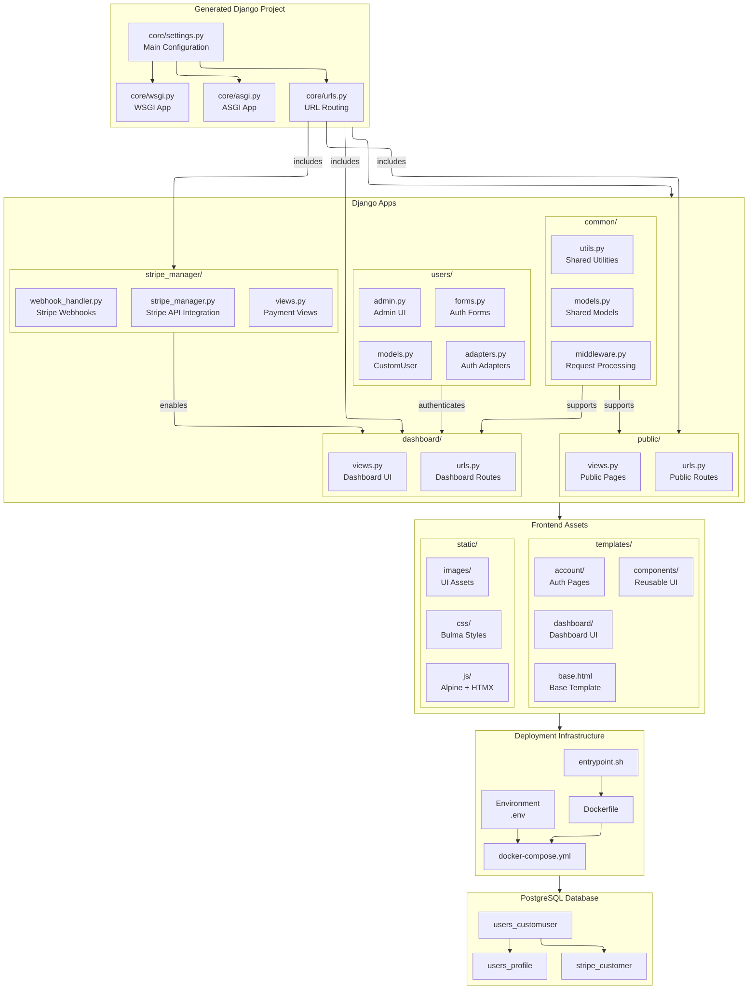
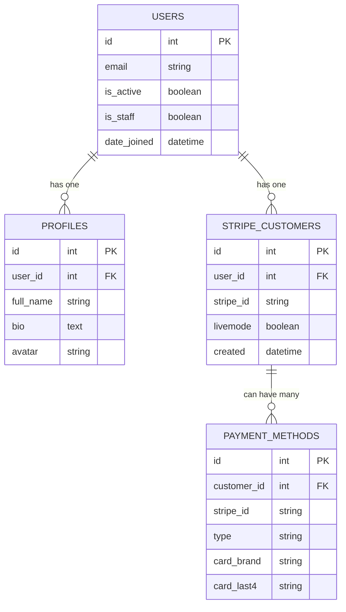

# **QuickScale Technical Documentation**

This document contains detailed technical information about the QuickScale project, including the tech stack, project structure, development workflows, and more.

This is a project generator that generates a project only once.
AI coding assistants must edit the template files (root cause or source files), not project generated files (destination files).

The main command for end users is `quickscale init`, which creates a new project from templates.
Project configuration is managed through environment variables with secure defaults.

## TECHNICAL STACK
- Django 5.0.1+ (backend framework)
    - Whitenoise 6.6.0+ (static files)
    - Psycopg2-binary 2.9.9+ (PostgreSQL adapter)
    - Python-dotenv 1.0.0+ (environment variables)
    - dj-database-url 2.1.0+ (database URL configuration)
    - django-allauth 0.52.0+ (authentication)
    - Uvicorn 0.27.0+ (ASGI server)
    - stripe 12.1.0+ for payment processing
- HTMX (frontend to backend communication for CRUD operations with the simplicity of HTML)
- Alpine.js (simple vanilla JS library for DOM manipulation)
- Bulma CSS (simple CSS styling without JavaScript) - Do not mix Tailwind or another alternatives
- PostgreSQL (database) - Do not use SQLite nor MySQL
- Configuration: Environment variables with secure defaults
- Deployment: Docker + Uvicorn

## PROJECT STRUCTURE

### QuickScale Project Generator Structure

This is the typical directory structure in the QuickScale project generator repository:

```
quickscale/
├── commands/                 # Command system implementation
├── config/                   # Configuration management
├── templates/                # Project template files
│   ├── common/               # Common Django app
│   │   ├── migrations/       # Pre-generated migrations
│   │   └── templates/        # App-specific templates
│   ├── core/                 # Core Django project
│   │   └── migrations/       # Pre-generated migrations
│   ├── dashboard/            # Dashboard Django app
│   │   ├── migrations/       # Pre-generated migrations
│   │   └── templates/        # App-specific templates
│   │   └── tests/            # App-specific tests
│   ├── stripe_manager/               # Stripe integration app
│   │   ├── management/       # Management commands
│   │   │   └── commands/     # Custom commands
│   │   ├── templates/        # App-specific templates
│   │   │   └── stripe_manager/       # Stripe templates
│   │   └── tests/            # Stripe tests
│   ├── docs/                 # Documentation files
│   ├── js/                   # JavaScript assets
│   ├── logs/                 # Log files directory
│   ├── public/               # Public Django app
│   │   ├── migrations/       # Pre-generated migrations
│   │   └── templates/        # App-specific templates
│   ├── static/               # Static files
│   │   ├── css/              # CSS files
│   │   └── js/               # JavaScript files
│   ├── templates/            # Global templates
│   │   ├── account/          # Authentication templates
│   │   │   └── email/        # Email templates
│   │   ├── base/             # Base templates
│   │   ├── components/       # Reusable components
│   │   ├── dashboard/        # Dashboard templates
│   │   ├── public/           # Public templates
│   │   └── users/            # User templates
│   ├── tests/                # Template tests
│   └── users/                # Users Django app
│       └── migrations/       # Pre-generated migrations
├── tests/                    # Test suite
└── utils/                    # Utility functions

tests/
├── core/                     # Core functionality tests
│   └── stripe_manager/               # Stripe integration tests
├── e2e/                      # End-to-end tests
│   └── support/              # E2E test support files
│       └── test_project_template/ # Test template
│           └── core/         # Core template
├── integration/              # Integration tests
├── unit/                     # Unit tests
│   ├── commands/             # Command tests
│   ├── fixtures/             # Test fixtures
│   └── utils/                # Utility tests
└── users/                    # User authentication tests
    └── migrations/           # Migration tests
```

### Generated Project Structure (Example)

This is the typical directory structure created when you run `quickscale init`:

```
PROJECT_NAME/
├── common/                 # Common Django app (shared models, utils)
├── core/                   # Core Django project settings and configurations
├── dashboard/              # User dashboard app
├── stripe_manager/              # Stripe integration app
├── docs/                   # Project-specific documentation
├── js/                     # JavaScript source files (e.g., Alpine.js components)
├── logs/                   # Log files directory
├── public/                 # Public-facing pages app (landing, about, contact)
├── static/                 # Compiled static assets (CSS, JS, images)
├── templates/              # Django HTML templates
│   ├── account/            # Authentication templates (allauth)
│   ├── base/               # Base layout templates
│   ├── components/         # Reusable UI components (navbar, footer)
│   ├── dashboard/          # Dashboard specific templates
│   ├── public/             # Public page templates
│   └── users/              # User profile and settings templates
├── tests/                  # Project tests
└── users/                  # Custom user model and authentication logic
```

## PROJECT ARCHITECTURE


### Generated Project Structure

This component diagram shows the detailed structure of a generated Django project:



### Command Execution Sequence

The following diagram illustrates the sequence of interactions when executing the `init` command:


### Project Lifecycle State Diagram

This state diagram shows the different states of a QuickScale project and transitions triggered by commands:


### Deployment Flow Diagram

This diagram shows the deployment architecture and request flow in a generated project:


### Command Class Hierarchy

This diagram shows the inheritance relationships between QuickScale command classes:


### Database ER Diagram

This entity-relationship diagram illustrates the database schema of the generated project:



## AUTHENTICATION

### Overview

- **Email-only authentication**: No usernames, only email addresses are used for authentication
- **Mandatory email verification**: Users must verify their email before accessing protected areas
- **Social authentication disabled**: No social login options (Google, Facebook, etc.)
- **Custom email templates**: Customized email templates for all authentication emails
- **Powered by django-allauth**: The authentication system is implemented using `django-allauth` for robust and extensible functionality.
- **Stripe Integration App**: The `stripe_manager` app handles Stripe integration.

### Configuration

The authentication system is configured in multiple files:

1. **core/settings.py**: Main Django settings file that imports email and `django-allauth` settings
2. **core/email_settings.py**: Dedicated file for email and `django-allauth` settings
3. **users/models.py**: Custom user model for email-only authentication
4. **users/adapters.py**: Custom adapters for `django-allauth`
5. **users/forms.py**: Custom forms for `django-allauth`
6. **templates/account/**: Email templates and HTML pages for authentication
7. **urls.py**: Routes for login, logout, and signup are handled by `django-allauth` views.

### Key django-allauth Settings

- `ACCOUNT_AUTHENTICATION_METHOD`: Set to `email` for email-only authentication.
- `ACCOUNT_EMAIL_VERIFICATION`: Set to `mandatory` to enforce email verification.
- `ACCOUNT_USERNAME_REQUIRED`: Set to `False` as usernames are not used.
- `ACCOUNT_ADAPTER`: Custom adapter located in `users.adapters.AccountAdapter`.
- `ACCOUNT_FORMS`: Custom forms for login, signup, and password management located in `users.forms`.

### Customizations

- **Custom User Model**: The `CustomUser` model in `users.models` replaces the default Django user model.
- **Custom Adapters**: The `AccountAdapter` and `SocialAccountAdapter` in `users.adapters` handle custom logic for email-only authentication and disable social login.
- **Custom Forms**: Forms in `users.forms` provide additional styling and validation for login, signup, and password reset.
- **Custom Templates**: All templates under `templates/account/` are customized for the QuickScale branding and user experience.

### Email Templates

Authentication email templates are located in:

```
templates/account/email/
```

Available templates:
- `email_confirmation_subject.txt` & `email_confirmation_message.txt`: Email verification
- `password_reset_key_subject.txt` & `password_reset_key_message.txt`: Password reset
- `email_confirmation_signup_subject.txt` & `email_confirmation_signup_message.txt`: New signup verification
- `account_already_exists_subject.txt` & `account_already_exists_message.txt`: Notice for duplicate accounts
- `unknown_account_subject.txt` & `unknown_account_message.txt`: Notice for unknown accounts

### HTML Templates

Authentication HTML templates are located in:

```
templates/account/
```

Key templates include:
- `login.html`: Login page
- `signup.html`: Registration page
- `email_confirm.html`: Email confirmation page
- `password_reset.html`: Password reset request page
- `verified_email_required.html`: Notice when email verification is required

### Customizing Authentication

#### Adding Custom Fields

To add custom fields to user registration:

1. Update the `CustomUser` model in `users/models.py` to include new fields
2. Update `CustomSignupForm` in `users/forms.py` to include the new fields
3. Update the `save()` method in `CustomSignupForm` to save the new fields

#### Changing Email Templates

To customize email templates:

1. Edit the text templates in `templates/account/email/`
2. Update the `send_mail()` method in `AccountAdapter` if needed

#### Changing Authentication Flow

To modify the authentication flow:

1. Override methods in `AccountAdapter` class in `users/adapters.py`
2. Update the django-allauth settings in `core/email_settings.py`
3. Customize the HTML templates in `templates/account/`

### Troubleshooting

#### Email Not Sending

1. Check EMAIL_* settings in your .env file
2. Verify your SMTP server is working
3. Check email backend setting in settings.py
4. In development, emails are sent to the console by default

#### User Can't Login After Registration

1. Check if email verification is required (ACCOUNT_EMAIL_VERIFICATION)
2. Check if the verification email was sent
3. Verify the user clicked the verification link
4. Check for errors in the Django logs

#### Customization Not Working

1. Make sure you're overriding the correct template
2. Check that your custom adapters are correctly registered in settings
3. Review django-allauth documentation for the correct method names
4. Clear your browser cache and Django cache

## ENVIRONMENT VARIABLES

The project uses a standardized environment variable system with validation and secure defaults.

### Environment Variable Validation

The system validates required variables based on component usage:

```python
# Required variables by component
REQUIRED_VARS = {
    'web': ['WEB_PORT', 'SECRET_KEY'],
    'db': ['DB_USER', 'DB_PASSWORD', 'DB_NAME'],
    'email': ['EMAIL_HOST', 'EMAIL_HOST_USER', 'EMAIL_HOST_PASSWORD'],
    'stripe_manager': ['STRIPE_PUBLIC_KEY', 'STRIPE_SECRET_KEY', 'STRIPE_WEBHOOK_SECRET']
}

# Production environment validation
from quickscale.utils.env_utils import get_env, is_feature_enabled

def validate_production_settings():
    """Validate settings for production environment."""
    # Use IS_PRODUCTION (opposite of old DEBUG logic). IS_PRODUCTION is False by default (development mode).
    if is_feature_enabled(get_env('IS_PRODUCTION', 'False')):
        if get_env('SECRET_KEY') == 'dev-only-dummy-key-replace-in-production':
            raise ValueError("Production requires a secure SECRET_KEY")
        if '*' in get_env('ALLOWED_HOSTS', '').split(','):
            raise ValueError("Production requires specific ALLOWED_HOSTS")
```

### Environment Variables by Component

### System Configuration Variables

| Variable            | Description                  | Default              |
|--------------------|------------------------------|---------------------|
| PROJECT_NAME        | Project name in templates    | QuickScale          |
| WEB_PORT           | Web server port              | 8000                |
| WEB_MEMORY_LIMIT   | Web container memory limit   | 1G                  |
| WEB_MEMORY_RESERVE | Web container memory reserve | 512M                |
| DOCKER_UID         | Docker user ID               | 1000                |
| DOCKER_GID         | Docker group ID              | 1000                |

### Database Variables

| Variable            | Description                  | Default              |
|--------------------|------------------------------|---------------------|
| DB_HOST            | Database hostname            | db                  |
| DB_PORT            | Database port                | 5432                |
| DB_NAME            | Database name                | admin               |
| DB_USER            | Database username            | admin               |
| DB_PASSWORD        | Database password            | adminpasswd         |
| DB_MEMORY_LIMIT    | Database memory limit        | 384M                |
| DB_MEMORY_RESERVE  | Database memory reserve      | 256M                |

### Security Variables

| Variable            | Description                  | Default              |
|--------------------|------------------------------|---------------------|
| DEBUG              | Debug mode                   | True                |
| SECRET_KEY         | Django secret key            | dev-only-dummy-key  |
| ALLOWED_HOSTS      | Allowed host names           | *                   |

### Email Variables

| Variable            | Description                  | Default              |
|--------------------|------------------------------|---------------------|
| EMAIL_HOST         | SMTP host                    | smtp.example.com    |
| EMAIL_PORT         | SMTP port                    | 587                 |
| EMAIL_HOST_USER    | SMTP username                | -                   |
| EMAIL_HOST_PASSWORD| SMTP password                | -                   |
| EMAIL_USE_TLS      | Use TLS for email           | True                |
| DEFAULT_FROM_EMAIL | Default sender email         | noreply@example.com |

### Feature Flags

| Variable                   | Description                  | Default              |
|---------------------------|------------------------------|---------------------|
| STRIPE_ENABLED            | Enable Stripe integration    | False               |
| STRIPE_LIVE_MODE          | Use Stripe live mode        | False               |
| ACCOUNT_EMAIL_VERIFICATION| Email verification required  | mandatory           |

### Port Fallback Configuration Variables

| Variable                              | Description                                    | Default |
|---------------------------------------|------------------------------------------------|---------|
| WEB_PORT_ALTERNATIVE_FALLBACK         | Enable automatic fallback for web port         | Disabled|
| DB_PORT_EXTERNAL_ALTERNATIVE_FALLBACK | Enable automatic fallback for database port    | Disabled|

When enabled, these settings allow QuickScale to automatically find and use alternative ports when the configured ports (WEB_PORT, DB_PORT_EXTERNAL) are already in use. This prevents port conflicts during development and deployment.

The system accepts various boolean formats for enabling these features:
* `yes`, `true`, `1`, `on`, `enabled`, `y`, `t` (all case-insensitive)

If these settings are disabled and a port conflict occurs, a clear error message is shown with recovery instructions.

### Environment Variable Best Practices

1. **Naming Conventions**
   - Use UPPERCASE for all environment variables
   - Use underscores as separators
   - Add component prefixes (WEB_, DB_, etc.)
   - Example: `WEB_PORT` instead of `PORT`

2. **Default Values**
   - All variables have secure defaults for development
   - Production values must be explicitly set
   - Sensitive values have clear "replace me" defaults

3. **Production Validation**
   - Required variables are validated on startup
   - Production mode enforces secure settings
   - Clear error messages guide configuration

4. **Documentation**
   - All variables are documented in .env.example
   - Comments explain purpose and valid values
   - Default values are clearly marked

### Environment Variable Loading

The project uses two different approaches for loading environment variables:

1. **CLI Commands**: CLI commands use direct access to values from .env files using the `from_env_file=True` parameter when calling environment variable utilities. This allows CLI commands to work without requiring the environment variables to be set in the system environment.

2. **Deployed Containers**: When deployed in containers, Django applications use environment variables that are loaded from the host system. 
- For production, these environment variables are configured to be read from the environment variables set in the host system.
- For development, same as production, but the variables are populated from the .env file during container creation.

This dual approach ensures that both local development and containerized deployments have consistent access to the necessary configuration values.

## DOCKER CONFIGURATION

The project uses Docker and Docker Compose for containerization:

1. **Web Container**: Django application
   - Base image: python:3.11-slim
   - Exposed port: 8000 by default, other if not available
   - Volumes: Local directory mounted to /app

2. **Database Container**: PostgreSQL
   - Image: postgres:15
   - Exposed port: 5432 by default, other if not available
   - Volumes: Persistent volume for data

## STARTER DATABASE

- User: 
  - email: user@test.com
  - password: userpasswd

- Administrator: 
  - email: admin@test.com
  - password: adminpasswd

## HTMX INTEGRATION

HTMX is used for dynamic content loading and form submissions without full page reloads:

1. **Form submissions**: Login, signup, and contact forms
2. **Dynamic content loading**: Dashboard components
3. **Real-time updates**: Notifications and messages

## ALPINE.JS INTEGRATION

Alpine.js is used for all client-side interactivity and state management:

1. **Dropdown menus**: Navigation bar
2. **Modal dialogs**: Confirmation dialogs
3. **Form validation**: Client-side validation
4. **Interactive UI components**: Password strength meters, toggles, etc.

### JavaScript Implementation Standards

- **Alpine.js Only**: All client-side interactions MUST be implemented using Alpine.js. Vanilla JavaScript or other frameworks (React, Vue, jQuery, etc.) are NOT permitted.
- **Component Structure**: Complex functionality should be organized as reusable Alpine.js components.
- **Declaration in Templates**: Alpine directives should be declared directly in HTML templates using the `x-data`, `x-bind`, `x-on`, etc. attributes.
- **Global Component Functions**: For reusable components, define global functions that return Alpine.js component data objects.
- **Minimal External Dependencies**: Avoid adding additional JavaScript libraries unless absolutely necessary.

**✅ DO: Use Alpine.js for interactive elements**
**❌ DON'T: Use vanilla JavaScript DOM manipulation**
**✅ DO: Use Alpine.js for form validation**
**❌ DON'T: Add other frameworks like jQuery or React**

## FEATURES

- **Authentication**: Powered by `django-allauth`, QuickScale provides secure email-only authentication with mandatory email verification. Social login is explicitly disabled for simplicity and security.
- **Custom User Model**: The `CustomUser` model supports email-based login and removes the need for usernames.