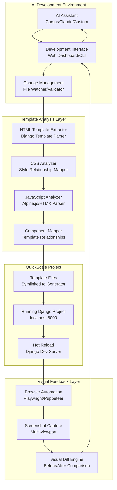

# **AI-Assisted Visual Development System**

*Real-time AI-powered webpage development with visual feedback for QuickScale projects*

## **📋 Table of Contents**

- [Overview](#overview)
- [System Architecture](#system-architecture)
- [HTML-First Approach](#html-first-approach)
- [Technical Implementation](#technical-implementation)
- [Development Workflow](#development-workflow)
- [AI Integration](#ai-integration)
- [Implementation Phases](#implementation-phases)
- [Code Examples](#code-examples)
- [Benefits & Challenges](#benefits--challenges)
- [Future Roadmap](#future-roadmap)

---

## **Overview**

### **The Vision**
Create an AI-assisted development system that enables AI assistants (Cursor, Claude, etc.) to:
- **See** the current webpage state (HTML + visual appearance)
- **Analyze** what needs to be changed based on user requests
- **Modify** QuickScale template files directly
- **Observe** immediate results in the running project
- **Iterate** based on visual feedback

### **Key Innovation**
Combine QuickScale's symlink workflow with AI visual analysis to create a **real-time feedback loop** where AI can see webpages and make immediate code changes.

### **Core Principle: HTML-First Development**
Unlike traditional DOM-based approaches, this system analyzes **source HTML templates** directly, preserving Django template variables and enabling immediate modifications.

---

## **System Architecture**

### **High-Level Architecture**



### **Data Flow**

```
User Request → AI Analysis → Template Extraction → Visual Context → 
Code Modification → Real-time Sync → Visual Verification → AI Feedback
```

---

## **HTML-First Approach**

### **Why HTML Over DOM?**

| Aspect | HTML-First | DOM-Based |
|--------|------------|-----------|
| **Directness** | ✅ Direct template modification | ❌ Reverse engineering needed |
| **Template Variables** | ✅ Preserves `{{ project_name }}` | ❌ Loses Django context |
| **Complexity** | ✅ Simple file operations | ❌ Complex DOM parsing |
| **Performance** | ✅ Fast file reading | ❌ Browser overhead |
| **Reliability** | ✅ Consistent results | ❌ Dynamic state variations |

### **HTML Analysis Components**

#### **1. Template Structure Recognition**
```html
<!-- AI understands Django template hierarchy -->



{{ project_name }} - Home


<div class="hero-section">
    <h1>{{ project_name }}</h1>
    <p class="lead">{{ hero_description|default:"Welcome to our platform" }}</p>
    <a href="" class="btn btn-primary">Get Started</a>
</div>

```

#### **2. CSS Relationship Mapping**
```html
<!-- AI connects HTML classes to CSS files -->
<div class="hero-section">  ← maps to static/css/styles.css .hero-section
    <h1 class="hero-title">  ← maps to static/css/styles.css .hero-title
```

#### **3. Component Identification**
```html
<!-- AI recognizes reusable components -->



```

#### **4. JavaScript Integration**
```html
<!-- AI understands Alpine.js and HTMX -->
<div x-data="{ showMore: false }" class="feature-section">
    <button @click="showMore = !showMore" class="btn">
        Toggle Features
    </button>
    <div x-show="showMore" class="features-list">
        <!-- Dynamic content -->
    </div>
</div>
```

---

## **Technical Implementation**

### **Core System Components**

#### **1. HTML Template Extractor**

```python
# quickscale/utils/ai_visual_dev/html_extractor.py

class HTMLTemplateExtractor:
    """Extract and analyze HTML templates from QuickScale projects."""
    
    def __init__(self, project_path: str):
        self.project_path = project_path
        self.templates_path = f"{project_path}/templates"
        self.static_path = f"{project_path}/static"
    
    def extract_template(self, template_path: str) -> Dict[str, Any]:
        """Extract template content with metadata."""
        return {
            'html_content': self._read_file(template_path),
            'template_variables': self._extract_template_vars(template_path),
            'css_dependencies': self._find_css_dependencies(template_path),
            'js_dependencies': self._find_js_dependencies(template_path),
            'component_includes': self._find_component_includes(template_path),
            'extends_base': self._find_extends_base(template_path)
        }
    
    def _extract_template_vars(self, template_path: str) -> List[str]:
        """Find Django template variables like {{ project_name }}."""
        pass
    
    def _find_css_dependencies(self, template_path: str) -> List[str]:
        """Find CSS classes used in template."""
        pass
    
    def _find_js_dependencies(self, template_path: str) -> List[str]:
        """Find JavaScript/Alpine.js dependencies."""
        pass
```

#### **2. Visual Feedback Engine**

```python
# quickscale/utils/ai_visual_dev/visual_engine.py

class VisualFeedbackEngine:
    """Capture and analyze visual feedback from running projects."""
    
    def __init__(self, project_url: str = "http://localhost:8000"):
        self.project_url = project_url
        self.browser = None
    
    async def capture_screenshot(self, 
                               page_path: str = "/", 
                               viewport: Dict[str, int] = None) -> str:
        """Capture screenshot of specific page."""
        viewport = viewport or {"width": 1920, "height": 1080}
        
        async with async_playwright() as p:
            browser = await p.chromium.launch()
            page = await browser.new_page()
            await page.set_viewport_size(viewport)
            await page.goto(f"{self.project_url}{page_path}")
            
            screenshot_path = f"screenshots/{page_path.replace('/', '_')}.png"
            await page.screenshot(path=screenshot_path, full_page=True)
            await browser.close()
            
            return screenshot_path
    
    async def capture_multi_viewport(self, page_path: str = "/") -> Dict[str, str]:
        """Capture screenshots across multiple viewports."""
        viewports = {
            "desktop": {"width": 1920, "height": 1080},
            "tablet": {"width": 768, "height": 1024},
            "mobile": {"width": 375, "height": 667}
        }
        
        screenshots = {}
        for viewport_name, viewport_size in viewports.items():
            screenshots[viewport_name] = await self.capture_screenshot(
                page_path, viewport_size
            )
        
        return screenshots
    
    async def visual_diff(self, before_path: str, after_path: str) -> Dict[str, Any]:
        """Compare before and after screenshots."""
        # Implementation for visual diffing
        pass
```

#### **3. AI Integration Layer**

```python
# quickscale/utils/ai_visual_dev/ai_integration.py

class AIVisualDevelopment:
    """Main AI integration for visual development."""
    
    def __init__(self, project_path: str):
        self.project_path = project_path
        self.html_extractor = HTMLTemplateExtractor(project_path)
        self.visual_engine = VisualFeedbackEngine()
        self.change_manager = ChangeManager(project_path)
    
    async def analyze_and_modify(self, 
                               user_request: str,
                               target_template: str = "templates/public/home.html") -> Dict[str, Any]:
        """Main AI analysis and modification workflow."""
        
        # Step 1: Extract current template state
        template_data = self.html_extractor.extract_template(target_template)
        
        # Step 2: Capture current visual state
        screenshots = await self.visual_engine.capture_multi_viewport()
        
        # Step 3: Prepare AI context
        ai_context = {
            'user_request': user_request,
            'template_content': template_data['html_content'],
            'css_content': self._get_css_content(template_data['css_dependencies']),
            'screenshots': screenshots,
            'template_variables': template_data['template_variables'],
            'component_context': self._get_component_context(template_data)
        }
        
        # Step 4: Get AI modifications
        ai_response = await self._call_ai_service(ai_context)
        
        # Step 5: Apply modifications
        changes_applied = await self.change_manager.apply_changes(ai_response)
        
        # Step 6: Capture results
        new_screenshots = await self.visual_engine.capture_multi_viewport()
        
        # Step 7: Generate feedback
        return {
            'changes_applied': changes_applied,
            'before_screenshots': screenshots,
            'after_screenshots': new_screenshots,
            'ai_explanation': ai_response.get('explanation', ''),
            'success': changes_applied.get('success', False)
        }
    
    async def _call_ai_service(self, context: Dict[str, Any]) -> Dict[str, Any]:
        """Call AI service with visual context."""
        # Implementation for AI service integration
        pass
```

#### **4. Change Management System**

```python
# quickscale/utils/ai_visual_dev/change_manager.py

class ChangeManager:
    """Manage file changes and synchronization."""
    
    def __init__(self, project_path: str):
        self.project_path = project_path
        self.backup_manager = BackupManager(project_path)
        self.validator = ChangeValidator()
    
    async def apply_changes(self, ai_response: Dict[str, Any]) -> Dict[str, Any]:
        """Apply AI-suggested changes to templates."""
        
        # Create backup before changes
        backup_id = self.backup_manager.create_backup()
        
        try:
            changes_applied = []
            
            for change in ai_response.get('changes', []):
                # Validate change
                if not self.validator.validate_change(change):
                    continue
                
                # Apply change
                success = await self._apply_single_change(change)
                changes_applied.append({
                    'file': change['file'],
                    'success': success,
                    'change_type': change['type']
                })
            
            return {
                'success': True,
                'changes_applied': changes_applied,
                'backup_id': backup_id
            }
            
        except Exception as e:
            # Rollback on error
            self.backup_manager.restore_backup(backup_id)
            return {
                'success': False,
                'error': str(e),
                'backup_id': backup_id
            }
    
    async def _apply_single_change(self, change: Dict[str, Any]) -> bool:
        """Apply a single file change."""
        file_path = f"{self.project_path}/{change['file']}"
        
        try:
            if change['type'] == 'html_modification':
                with open(file_path, 'w', encoding='utf-8') as f:
                    f.write(change['new_content'])
                return True
            
            elif change['type'] == 'css_modification':
                with open(file_path, 'w', encoding='utf-8') as f:
                    f.write(change['new_content'])
                return True
            
            # Add other change types as needed
            return False
            
        except Exception as e:
            print(f"Error applying change to {file_path}: {e}")
            return False
```

### **Development Interface Options**

#### **Option 1: CLI Interface**

```bash
# Command-line interface for AI visual development
quickscale ai-dev start my-project
quickscale ai-dev analyze "make homepage more modern"
quickscale ai-dev capture-screenshots --viewport all
quickscale ai-dev rollback --backup-id abc123
```

#### **Option 2: Web Dashboard**

```python
# quickscale/utils/ai_visual_dev/web_dashboard.py

class WebDashboard:
    """Web-based interface for AI visual development."""
    
    def __init__(self, project_path: str):
        self.app = FastAPI()
        self.project_path = project_path
        self.ai_dev = AIVisualDevelopment(project_path)
        self._setup_routes()
    
    def _setup_routes(self):
        @self.app.get("/")
        async def dashboard():
            return {"message": "AI Visual Development Dashboard"}
        
        @self.app.post("/analyze")
        async def analyze_request(request: AnalyzeRequest):
            result = await self.ai_dev.analyze_and_modify(
                request.user_request,
                request.target_template
            )
            return result
        
        @self.app.get("/screenshots/{page_path}")
        async def get_screenshots(page_path: str):
            screenshots = await self.ai_dev.visual_engine.capture_multi_viewport(page_path)
            return screenshots
        
        @self.app.post("/rollback")
        async def rollback_changes(request: RollbackRequest):
            success = self.ai_dev.change_manager.backup_manager.restore_backup(
                request.backup_id
            )
            return {"success": success}
```

#### **Option 3: VS Code Extension**

```typescript
// VS Code extension for AI visual development
export class AIVisualDevExtension {
    private panel: vscode.WebviewPanel | undefined;
    private quickscaleProject: string;
    
    constructor(context: vscode.ExtensionContext) {
        this.quickscaleProject = this.findQuickscaleProject();
        this.setupCommands(context);
    }
    
    private setupCommands(context: vscode.ExtensionContext) {
        // Register AI visual development commands
        const analyzeCommand = vscode.commands.registerCommand(
            'quickscale.aiVisualDev.analyze',
            async () => {
                const userRequest = await vscode.window.showInputBox({
                    prompt: 'What would you like to change?',
                    placeHolder: 'e.g., "make the homepage more modern"'
                });
                
                if (userRequest) {
                    await this.analyzeAndModify(userRequest);
                }
            }
        );
        
        context.subscriptions.push(analyzeCommand);
    }
    
    private async analyzeAndModify(userRequest: string) {
        // Call Python AI service
        const result = await this.callPythonService('analyze', {
            user_request: userRequest,
            project_path: this.quickscaleProject
        });
        
        // Show results in webview panel
        this.showResults(result);
    }
    
    private showResults(result: any) {
        // Create or update webview panel with results
        // Show before/after screenshots
        // Display AI explanation
        // Allow rollback if needed
    }
}
```

---

## **Development Workflow**

### **Complete AI Visual Development Process**

#### **Step 1: Project Setup**
```bash
# Setup symlink development environment
cd quickscale
quickscale init-dev my-ai-project  # Future Sprint 24 command
cd my-ai-project

# Or manual setup for now
./setup_symlink_development.sh ./quickscale my-ai-project
cd my-ai-project
```

#### **Step 2: Start AI Visual Development**
```bash
# Start project
quickscale up

# Initialize AI visual development
quickscale ai-dev start
# This starts:
# - File watcher for template changes
# - Screenshot capture service
# - AI integration API
# - Django request monitoring (auto-detects current page)
# - Browser activity tracking (optional)
```

#### **Step 3: AI-Assisted Development**
```bash
# Natural language development requests
quickscale ai-dev analyze "make the homepage hero section more modern and engaging"

# AI Process:
# 1. Reads templates/public/home.html
# 2. Reads static/css/styles.css
# 3. Captures current screenshots
# 4. Analyzes user request
# 5. Modifies template files
# 6. Captures new screenshots
# 7. Shows before/after comparison
```

#### **Step 4: Iteration and Refinement**
```bash
# Continue iteration
quickscale ai-dev analyze "make the call-to-action button more prominent"
quickscale ai-dev analyze "improve the color scheme for better accessibility"

# Review changes
quickscale ai-dev history
quickscale ai-dev screenshots --page home

# Rollback if needed
quickscale ai-dev rollback --backup-id abc123
```

### **AI Interaction Examples**

#### **Example 1: Homepage Modernization**
```
User: "Make the homepage hero section more modern"

AI Analysis:
- Current HTML: Basic div with text and button
- Current CSS: Simple background, standard typography
- Screenshot: Plain, dated design
- Suggestion: Add gradient background, improve typography, modern button styles

AI Response:
"I can see the hero section uses a basic layout. Let me improve it with:
- Modern gradient background
- Better typography hierarchy
- Improved call-to-action button
- Enhanced responsive design"

Changes Applied:
- templates/public/home.html: Updated HTML structure
- static/css/styles.css: Added modern styles
- Result: Modern, engaging hero section
```

#### **Example 2: Accessibility Improvements**
```
User: "Improve accessibility of the signup form"

AI Analysis:
- Current HTML: Basic form elements
- Current CSS: Standard styling
- Screenshot: Form visible but accessibility unclear
- Suggestion: Add ARIA labels, improve contrast, better focus states

AI Response:
"I'll enhance the signup form accessibility by:
- Adding proper ARIA labels
- Improving color contrast ratios
- Adding focus indicators
- Including form validation feedback"

Changes Applied:
- templates/account/signup.html: Added ARIA attributes
- static/css/styles.css: Improved contrast and focus styles
- Result: Accessible, compliant signup form
```

---

## **Automatic Page Detection**

### **Smart Context Awareness**
The system can automatically detect which page you're currently viewing without manual URL input, using multiple detection methods:

### **Method 1: Django Request Monitoring (Primary)**
**How it works:** Hook into Django's development server to track page requests in real-time.

```python
# quickscale/utils/ai_visual_dev/page_detector.py

class DjangoPageDetector:
    """Monitor Django requests to detect current page."""
    
    def __init__(self):
        self.current_page = "/"
        self.recent_pages = []
        self.page_history = {}
    
    def setup_middleware(self):
        """Add middleware to Django settings for request tracking."""
        return 'quickscale.utils.ai_visual_dev.middleware.PageDetectionMiddleware'
    
    def track_request(self, request):
        """Track incoming Django requests."""
        page_path = request.path
        timestamp = time.time()
        
        # Update current page
        self.current_page = page_path
        
        # Track recent activity
        self.recent_pages.append({
            'path': page_path,
            'timestamp': timestamp,
            'method': request.method,
            'template': self._detect_template(request)
        })
        
        # Keep only last 10 pages
        self.recent_pages = self.recent_pages[-10:]
        
        return page_path
    
    def _detect_template(self, request):
        """Detect which template will be used for this request."""
        # Implementation to map URL to template
        pass
    
    def get_current_context(self):
        """Get current page context for AI analysis."""
        return {
            'current_page': self.current_page,
            'recent_pages': self.recent_pages,
            'suggested_template': self._get_template_for_page(self.current_page)
        }
```

```python
# quickscale/utils/ai_visual_dev/middleware.py

class PageDetectionMiddleware:
    """Django middleware for automatic page detection."""
    
    def __init__(self, get_response):
        self.get_response = get_response
        self.page_detector = DjangoPageDetector()
    
    def __call__(self, request):
        # Track the request
        self.page_detector.track_request(request)
        
        # Continue with normal Django processing
        response = self.get_response(request)
        
        return response
```

### **Method 2: Browser Extension (Secondary)**
**How it works:** Lightweight browser extension communicates current tab URL to QuickScale.

```javascript
// browser_extension/content.js

class QuickScalePageDetector {
    constructor() {
        this.quickscalePort = null;
        this.currentUrl = window.location.href;
        this.init();
    }
    
    init() {
        // Only activate on localhost QuickScale projects
        if (this.isQuickScaleProject()) {
            this.setupCommunication();
            this.trackNavigation();
        }
    }
    
    isQuickScaleProject() {
        return window.location.hostname === 'localhost' && 
               (window.location.port === '8000' || window.location.port === '8001');
    }
    
    setupCommunication() {
        // Connect to QuickScale native app
        this.quickscalePort = chrome.runtime.connectNative('com.quickscale.pagedetector');
        
        // Send current page immediately
        this.reportCurrentPage();
    }
    
    trackNavigation() {
        // Track URL changes (SPA navigation)
        let lastUrl = location.href;
        new MutationObserver(() => {
            const url = location.href;
            if (url !== lastUrl) {
                lastUrl = url;
                this.currentUrl = url;
                this.reportCurrentPage();
            }
        }).observe(document, {subtree: true, childList: true});
        
        // Track traditional navigation
        window.addEventListener('popstate', () => {
            this.currentUrl = window.location.href;
            this.reportCurrentPage();
        });
    }
    
    reportCurrentPage() {
        if (this.quickscalePort) {
            this.quickscalePort.postMessage({
                type: 'PAGE_CHANGE',
                url: this.currentUrl,
                path: window.location.pathname,
                timestamp: Date.now(),
                title: document.title
            });
        }
    }
}

// Initialize if on QuickScale project
new QuickScalePageDetector();
```

### **Method 3: File System Monitoring (Tertiary)**
**How it works:** Watch template file access patterns to infer current page.

```python
# quickscale/utils/ai_visual_dev/file_monitor.py

class TemplateFileMonitor:
    """Monitor template file access to detect current page."""
    
    def __init__(self, project_path: str):
        self.project_path = project_path
        self.templates_path = f"{project_path}/templates"
        self.access_log = []
        self.current_template = None
    
    def start_monitoring(self):
        """Start monitoring template file access."""
        from watchdog.observers import Observer
        from watchdog.events import FileSystemEventHandler
        
        class TemplateAccessHandler(FileSystemEventHandler):
            def __init__(self, monitor):
                self.monitor = monitor
            
            def on_accessed(self, event):
                if event.is_directory:
                    return
                
                if event.src_path.endswith('.html'):
                    self.monitor.track_template_access(event.src_path)
        
        observer = Observer()
        observer.schedule(
            TemplateAccessHandler(self), 
            self.templates_path, 
            recursive=True
        )
        observer.start()
        
        return observer
    
    def track_template_access(self, template_path: str):
        """Track template file access."""
        relative_path = template_path.replace(self.templates_path + '/', '')
        
        self.access_log.append({
            'template': relative_path,
            'timestamp': time.time(),
            'inferred_page': self._infer_page_from_template(relative_path)
        })
        
        # Keep only recent accesses
        self.access_log = self.access_log[-20:]
        
        # Update current template
        self.current_template = relative_path
    
    def _infer_page_from_template(self, template_path: str) -> str:
        """Infer page URL from template path."""
        # Map template paths to likely URLs
        template_map = {
            'public/home.html': '/',
            'public/about.html': '/about/',
            'public/contact.html': '/contact/',
            'account/login.html': '/accounts/login/',
            'account/signup.html': '/accounts/signup/',
            'users/profile.html': '/users/profile/',
            'admin_dashboard/index.html': '/admin_dashboard/',
        }
        
        return template_map.get(template_path, f'/{template_path}')
    
    def get_current_context(self):
        """Get current page context from file monitoring."""
        return {
            'current_template': self.current_template,
            'recent_accesses': self.access_log[-5:],
            'inferred_page': self._infer_page_from_template(self.current_template) if self.current_template else '/'
        }
```

### **Method 4: Browser Process Monitoring (Alternative)**
**How it works:** Monitor browser processes to detect active localhost URLs.

```python
# quickscale/utils/ai_visual_dev/browser_monitor.py

class BrowserProcessMonitor:
    """Monitor browser processes to detect active QuickScale pages."""
    
    def __init__(self):
        self.current_page = "/"
        self.supported_browsers = ['chrome', 'firefox', 'safari', 'edge']
    
    def detect_active_page(self):
        """Detect currently active QuickScale page in browser."""
        import psutil
        
        for proc in psutil.process_iter(['pid', 'name', 'cmdline']):
            try:
                if any(browser in proc.info['name'].lower() for browser in self.supported_browsers):
                    # Check command line for localhost URLs
                    cmdline = ' '.join(proc.info['cmdline'] or [])
                    
                    if 'localhost:8000' in cmdline or 'localhost:8001' in cmdline:
                        # Extract URL from command line
                        url = self._extract_url_from_cmdline(cmdline)
                        if url:
                            self.current_page = url
                            return url
            except (psutil.NoSuchProcess, psutil.AccessDenied):
                continue
        
        return self.current_page
    
    def _extract_url_from_cmdline(self, cmdline: str) -> str:
        """Extract localhost URL from browser command line."""
        import re
        
        # Look for localhost URLs in command line
        pattern = r'localhost:[0-9]+(/[^"\s]*)?'
        matches = re.findall(pattern, cmdline)
        
        if matches:
            return matches[0] if matches[0] else '/'
        
        return None
```

### **Integrated Page Detection System**

```python
# quickscale/utils/ai_visual_dev/smart_page_detector.py

class SmartPageDetector:
    """Intelligent page detection using multiple methods."""
    
    def __init__(self, project_path: str):
        self.project_path = project_path
        self.django_detector = DjangoPageDetector()
        self.file_monitor = TemplateFileMonitor(project_path)
        self.browser_monitor = BrowserProcessMonitor()
        self.current_page = "/"
        self.confidence_scores = {}
    
    def start_detection(self):
        """Start all detection methods."""
        # Method 1: Django request monitoring (highest confidence)
        self.django_detector.setup_middleware()
        
        # Method 2: File system monitoring (medium confidence)
        self.file_monitor.start_monitoring()
        
        # Method 3: Browser process monitoring (low confidence)
        # Only used as fallback
        
        print("✅ Smart page detection started")
        print("   - Django request monitoring: Active")
        print("   - Template file monitoring: Active")
        print("   - Browser process monitoring: Standby")
    
    def get_current_page(self) -> Dict[str, Any]:
        """Get current page with confidence scoring."""
        # Collect data from all sources
        django_context = self.django_detector.get_current_context()
        file_context = self.file_monitor.get_current_context()
        
        # Determine most reliable source
        if django_context['current_page'] and django_context['current_page'] != '/':
            # Django monitoring is most reliable
            current_page = django_context['current_page']
            confidence = 0.9
            source = "django_requests"
        
        elif file_context['current_template']:
            # File monitoring as backup
            current_page = file_context['inferred_page']
            confidence = 0.7
            source = "file_monitoring"
        
        else:
            # Browser monitoring as last resort
            current_page = self.browser_monitor.detect_active_page()
            confidence = 0.5
            source = "browser_process"
        
        return {
            'current_page': current_page,
            'confidence': confidence,
            'source': source,
            'template_context': file_context,
            'request_context': django_context
        }
```

### **Enhanced CLI Commands**

```bash
# AI automatically detects current page
quickscale ai-dev analyze "make this page more modern"
# AI knows you're on /about/ page automatically

# Override detection if needed
quickscale ai-dev analyze "make this page more modern" --page /contact/

# See what page AI thinks you're on
quickscale ai-dev current-page
# Output: "Currently detecting: /about/ (confidence: 90%, source: django_requests)"

# Monitor page detection in real-time
quickscale ai-dev monitor
# Output: Live feed of page changes as you navigate
```

### **Usage Examples**

```python
# Example: AI automatically knows current page
async def analyze_with_auto_detection():
    detector = SmartPageDetector(project_path)
    
    # Start detection
    detector.start_detection()
    
    # User navigates to /about/ page in browser
    # System automatically detects this
    
    # AI analysis request
    page_context = detector.get_current_page()
    
    # AI gets context automatically
    ai_context = {
        'current_page': page_context['current_page'],  # "/about/"
        'template_path': 'templates/public/about.html',  # Automatically mapped
        'confidence': page_context['confidence'],  # 0.9
        'user_request': "make this page more modern"
    }
    
    # AI knows exactly which page to modify
    result = await ai_service.analyze_and_modify(ai_context)
```

### **Browser Extension Installation (Optional)**

```json
// manifest.json for optional browser extension
{
  "manifest_version": 3,
  "name": "QuickScale Page Detector",
  "version": "1.0",
  "description": "Automatically detect current page for QuickScale AI development",
  "permissions": ["activeTab", "nativeMessaging"],
  "content_scripts": [{
    "matches": ["http://localhost:8000/*", "http://localhost:8001/*"],
    "js": ["content.js"]
  }],
  "background": {
    "service_worker": "background.js"
  }
}
```

### **Benefits of Automatic Detection**

#### **User Experience**
- ✅ **No manual URL input** - System knows where you are
- ✅ **Context-aware AI** - AI analyzes the right page automatically
- ✅ **Seamless workflow** - Navigate and analyze without interruption
- ✅ **Real-time updates** - Detection updates as you navigate

#### **Development Efficiency**
- ✅ **Faster iterations** - No need to specify pages manually
- ✅ **Reduced errors** - No typing wrong URLs
- ✅ **Better accuracy** - AI always works on current page
- ✅ **Smart suggestions** - AI learns from navigation patterns

#### **Technical Advantages**
- ✅ **Multiple fallbacks** - If one method fails, others continue
- ✅ **Confidence scoring** - System knows how reliable detection is
- ✅ **Template mapping** - Automatically maps URLs to template files
- ✅ **History tracking** - Remembers recent pages for context

---

## **AI Integration**

### **AI Service Requirements**

#### **Input Format for AI**
```json
{
  "user_request": "Make the homepage more modern",
  "template_content": "...",
  "css_content": ".hero-section { background: #fff; }...",
  "screenshots": {
    "desktop": "path/to/desktop_screenshot.png",
    "tablet": "path/to/tablet_screenshot.png",
    "mobile": "path/to/mobile_screenshot.png"
  },
  "template_variables": ["project_name", "user", "hero_description"],
  "component_context": {
    "includes": ["components/navbar.html", "components/footer.html"],
    "extends": "base.html"
  },
  "project_context": {
    "framework": "QuickScale/Django",
    "css_framework": "Bulma",
    "js_libraries": ["Alpine.js", "HTMX"]
  }
}
```

#### **Expected AI Output**
```json
{
  "analysis": {
    "current_state": "The homepage uses a basic layout with standard typography...",
    "improvement_areas": ["Modern design", "Better typography", "Improved CTA"],
    "accessibility_issues": ["Low contrast", "Missing ARIA labels"]
  },
  "changes": [
    {
      "file": "templates/public/home.html",
      "type": "html_modification",
      "new_content": "...",
      "explanation": "Updated HTML structure for modern layout"
    },
    {
      "file": "static/css/styles.css",
      "type": "css_modification",
      "new_content": ".hero-section { background: linear-gradient(...); }",
      "explanation": "Added modern gradient background and improved typography"
    }
  ],
  "explanation": "I've modernized the homepage by adding a gradient background, improving typography hierarchy, and enhancing the call-to-action button. The changes maintain all Django template variables and are fully responsive.",
  "verification_steps": [
    "Check responsive design across all viewports",
    "Verify template variables render correctly",
    "Test accessibility with screen readers"
  ]
}
```

### **AI Prompt Engineering**

#### **System Prompt Template**
```
You are an expert web developer specializing in Django/QuickScale projects. 
You have the ability to see webpages through screenshots and modify HTML templates directly.

Your capabilities:
- Analyze HTML templates with Django template syntax
- Understand CSS relationships and styling
- Preserve Django template variables like {{ project_name }}
- Make responsive design improvements
- Ensure accessibility compliance
- Maintain code quality and best practices

When making changes:
1. Always preserve Django template variables and syntax
2. Maintain responsive design principles
3. Follow modern web development best practices
4. Ensure accessibility standards are met
5. Provide clear explanations for your changes

Current project context:
- Framework: Django with QuickScale
- CSS Framework: Bulma
- JavaScript: Alpine.js and HTMX
- Template system: Django templates
```

#### **Request Prompt Template**
```
User Request: "{user_request}"

Current Template Content:
```html
{template_content}
```

Current CSS Content:
```css
{css_content}
```

Current Screenshots:
- Desktop: [Image attached]
- Tablet: [Image attached]  
- Mobile: [Image attached]

Template Variables to Preserve:
{template_variables}

Please analyze the current state and provide specific improvements based on the user request.
Return your response in the specified JSON format with detailed explanations.
```

---

## **Implementation Phases**

### **Phase 1: Foundation (Weeks 1-2)**
**Goal:** Basic HTML extraction and screenshot capture

**Components:**
- [ ] HTML Template Extractor
- [ ] CSS Relationship Mapper
- [ ] Basic Screenshot Capture
- [ ] File Change Manager
- [ ] Simple CLI Interface

**Deliverables:**
- `quickscale ai-dev extract-html templates/public/home.html`
- `quickscale ai-dev screenshot --page home`
- `quickscale ai-dev apply-changes changes.json`

### **Phase 2: AI Integration (Weeks 3-4)**
**Goal:** Connect AI services for analysis and modifications

**Components:**
- [ ] AI Service Integration
- [ ] Change Validation System
- [ ] Backup and Rollback
- [ ] Multi-viewport Screenshots
- [ ] Visual Diff Engine

**Deliverables:**
- `quickscale ai-dev analyze "make homepage modern"`
- `quickscale ai-dev rollback --backup-id abc123`
- `quickscale ai-dev diff --before before.png --after after.png`

### **Phase 3: Advanced Analysis (Weeks 5-6)**
**Goal:** Sophisticated template and component analysis

**Components:**
- [ ] Component Recognition
- [ ] Template Relationship Mapping
- [ ] JavaScript/Alpine.js Integration
- [ ] Advanced CSS Analysis
- [ ] Performance Monitoring

**Deliverables:**
- Component-aware modifications
- JavaScript interaction understanding
- Performance optimization suggestions
- Advanced CSS relationship mapping

### **Phase 4: Development Interface (Weeks 7-8)**
**Goal:** User-friendly interfaces for AI visual development

**Components:**
- [ ] Web Dashboard
- [ ] VS Code Extension
- [ ] Real-time Change Monitoring
- [ ] Interactive Screenshot Annotation
- [ ] Collaborative Features

**Deliverables:**
- Web-based AI development interface
- VS Code extension with visual preview
- Real-time change monitoring
- Team collaboration features

### **Phase 5: Production Ready (Weeks 9-10)**
**Goal:** Stable, production-ready system

**Components:**
- [ ] Error Handling and Recovery
- [ ] Performance Optimization
- [ ] Security Validation
- [ ] Comprehensive Testing
- [ ] Documentation and Tutorials

**Deliverables:**
- Production-ready AI visual development system
- Complete documentation
- Video tutorials
- Integration with QuickScale CLI

---

## **Code Examples**

### **HTML Template Analysis**

```python
# quickscale/utils/ai_visual_dev/template_analyzer.py

class TemplateAnalyzer:
    """Analyze Django templates for AI processing."""
    
    def analyze_template(self, template_path: str) -> Dict[str, Any]:
        """Comprehensive template analysis."""
        content = self._read_template(template_path)
        
        return {
            'template_vars': self._extract_template_vars(content),
            'blocks': self._extract_blocks(content),
            'includes': self._extract_includes(content),
            'extends': self._extract_extends(content),
            'css_classes': self._extract_css_classes(content),
            'html_structure': self._analyze_html_structure(content),
            'accessibility': self._analyze_accessibility(content)
        }
    
    def _extract_template_vars(self, content: str) -> List[str]:
        """Extract Django template variables."""
        import re
        return re.findall(r'\{\{\s*([^}]+)\s*\}\}', content)
    
    def _extract_blocks(self, content: str) -> List[str]:
        """Extract Django template blocks."""
        import re
        return re.findall(r'\{\%\s*block\s+([^%]+)\s*\%\}', content)
    
    def _extract_includes(self, content: str) -> List[str]:
        """Extract template includes."""
        import re
        return re.findall(r'\{\%\s*include\s+["\']([^"\']+)["\']', content)
    
    def _analyze_html_structure(self, content: str) -> Dict[str, Any]:
        """Analyze HTML structure for AI understanding."""
        from bs4 import BeautifulSoup
        
        # Parse HTML while preserving Django template syntax
        soup = BeautifulSoup(content, 'html.parser')
        
        return {
            'main_sections': self._identify_main_sections(soup),
            'navigation': self._identify_navigation(soup),
            'forms': self._identify_forms(soup),
            'interactive_elements': self._identify_interactive_elements(soup)
        }
```

### **AI Service Integration**

```python
# quickscale/utils/ai_visual_dev/ai_service.py

class AIService:
    """Integration with AI services for visual development."""
    
    def __init__(self, service_type: str = "openai"):
        self.service_type = service_type
        self.client = self._initialize_client()
    
    async def analyze_and_suggest(self, context: Dict[str, Any]) -> Dict[str, Any]:
        """Get AI analysis and suggestions."""
        
        prompt = self._build_prompt(context)
        
        if self.service_type == "openai":
            response = await self._call_openai(prompt, context['screenshots'])
        elif self.service_type == "anthropic":
            response = await self._call_anthropic(prompt, context['screenshots'])
        else:
            raise ValueError(f"Unsupported AI service: {self.service_type}")
        
        return self._parse_ai_response(response)
    
    def _build_prompt(self, context: Dict[str, Any]) -> str:
        """Build AI prompt with context."""
        return f"""
        User Request: {context['user_request']}
        
        Current Template:
        ```html
        {context['template_content']}
        ```
        
        Current CSS:
        ```css
        {context['css_content']}
        ```
        
        Template Variables to Preserve: {context['template_variables']}
        
        Please analyze the screenshots and provide specific improvements.
        Return your response in JSON format with:
        - analysis: Your analysis of the current state
        - changes: Array of specific file changes to make
        - explanation: Clear explanation of your improvements
        """
    
    async def _call_openai(self, prompt: str, screenshots: Dict[str, str]) -> str:
        """Call OpenAI API with vision."""
        import openai
        
        messages = [
            {"role": "system", "content": "You are a web development expert..."},
            {"role": "user", "content": prompt}
        ]
        
        # Add screenshots
        for viewport, screenshot_path in screenshots.items():
            messages.append({
                "role": "user",
                "content": f"Screenshot ({viewport}): {screenshot_path}"
            })
        
        response = await openai.ChatCompletion.acreate(
            model="gpt-4-vision-preview",
            messages=messages,
            max_tokens=2000
        )
        
        return response.choices[0].message.content
```

### **Change Application System**

```python
# quickscale/utils/ai_visual_dev/change_applicator.py

class ChangeApplicator:
    """Apply AI-suggested changes to templates."""
    
    def __init__(self, project_path: str):
        self.project_path = project_path
        self.backup_manager = BackupManager(project_path)
    
    async def apply_changes(self, changes: List[Dict[str, Any]]) -> Dict[str, Any]:
        """Apply multiple changes atomically."""
        backup_id = self.backup_manager.create_backup()
        applied_changes = []
        
        try:
            for change in changes:
                success = await self._apply_single_change(change)
                applied_changes.append({
                    'file': change['file'],
                    'success': success,
                    'type': change['type']
                })
            
            return {
                'success': True,
                'applied_changes': applied_changes,
                'backup_id': backup_id
            }
        
        except Exception as e:
            # Rollback on any error
            self.backup_manager.restore_backup(backup_id)
            return {
                'success': False,
                'error': str(e),
                'backup_id': backup_id
            }
    
    async def _apply_single_change(self, change: Dict[str, Any]) -> bool:
        """Apply a single change to a file."""
        file_path = f"{self.project_path}/{change['file']}"
        
        # Validate change before applying
        if not self._validate_change(change):
            return False
        
        try:
            # Make the change
            with open(file_path, 'w', encoding='utf-8') as f:
                f.write(change['new_content'])
            
            # Verify the change
            return self._verify_change(file_path, change)
        
        except Exception as e:
            print(f"Error applying change to {file_path}: {e}")
            return False
    
    def _validate_change(self, change: Dict[str, Any]) -> bool:
        """Validate change before applying."""
        # Check file exists
        file_path = f"{self.project_path}/{change['file']}"
        if not os.path.exists(file_path):
            return False
        
        # Validate content based on file type
        if change['file'].endswith('.html'):
            return self._validate_html_content(change['new_content'])
        elif change['file'].endswith('.css'):
            return self._validate_css_content(change['new_content'])
        
        return True
    
    def _validate_html_content(self, content: str) -> bool:
        """Validate HTML content."""
        try:
            from bs4 import BeautifulSoup
            soup = BeautifulSoup(content, 'html.parser')
            return True
        except:
            return False
    
    def _validate_css_content(self, content: str) -> bool:
        """Validate CSS content."""
        try:
            import tinycss2
            tinycss2.parse_stylesheet(content)
            return True
        except:
            return False
```

---

## **Benefits & Challenges**

### **Benefits**

#### **For Developers**
- ✅ **Faster Development**: Visual changes in real-time
- ✅ **Better Design Decisions**: AI-powered insights
- ✅ **Reduced Iteration Time**: Immediate feedback
- ✅ **Improved Accessibility**: Automated compliance checking
- ✅ **Consistent Design**: Maintain design system standards
- ✅ **Learning Tool**: Learn from AI suggestions

#### **For AI Assistants**
- ✅ **Visual Understanding**: See what users see
- ✅ **Better Context**: Understand design intent
- ✅ **Immediate Feedback**: Verify changes work
- ✅ **Learning Capability**: Improve from results
- ✅ **Holistic Development**: Consider visual and functional aspects

#### **For QuickScale Projects**
- ✅ **Higher Quality Templates**: AI-optimized designs
- ✅ **Modern UI Patterns**: Contemporary design trends
- ✅ **Better User Experience**: AI-analyzed improvements
- ✅ **Faster Development**: Visual development workflow
- ✅ **Consistent Quality**: AI ensures standards

### **Challenges**

#### **Technical Challenges**
- ⚠️ **Complexity**: Multiple integrated systems
- ⚠️ **Performance**: Screenshot capture and processing overhead
- ⚠️ **Reliability**: Ensuring consistent results
- ⚠️ **Error Handling**: Graceful failure recovery
- ⚠️ **Synchronization**: Real-time change coordination

#### **AI Challenges**
- ⚠️ **Context Understanding**: Ensuring AI understands requirements
- ⚠️ **Template Preservation**: Maintaining Django template syntax
- ⚠️ **Design Consistency**: Ensuring cohesive design changes
- ⚠️ **Performance Impact**: AI processing time
- ⚠️ **Quality Control**: Validating AI suggestions

#### **Implementation Challenges**
- ⚠️ **Browser Automation**: Reliable screenshot capture
- ⚠️ **File Synchronization**: Preventing conflicts
- ⚠️ **Multi-platform Support**: Working across different systems
- ⚠️ **Integration Complexity**: Connecting all components
- ⚠️ **User Experience**: Making the system intuitive

### **Risk Mitigation**

#### **Backup and Recovery**
- **Automatic Backups**: Before every change
- **Rollback Capability**: Easy change reversal
- **Version Control**: Git integration
- **Change Validation**: Pre-flight checks
- **Manual Override**: Always allow manual control

#### **Quality Assurance**
- **Change Validation**: Syntax and semantic checks
- **Testing Integration**: Automated testing after changes
- **Human Review**: Option for manual approval
- **Gradual Rollout**: Phased implementation
- **Monitoring**: Track system performance and reliability

---

## **Implementation Roadmap**

### **Phase 1: Core System (Q1 2024) - PRIMARY FOCUS**
**Goal:** Basic AI visual development integrated into QuickScale CLI

**Components to Build:**
- [ ] HTML Template Extractor (`quickscale/utils/ai_visual_dev/html_extractor.py`)
- [ ] Basic Screenshot Capture (`quickscale/utils/ai_visual_dev/visual_engine.py`)
- [ ] Simple AI Integration (`quickscale/utils/ai_visual_dev/ai_integration.py`)
- [ ] Change Application System (`quickscale/utils/ai_visual_dev/change_manager.py`)
- [ ] Smart Page Detection (`quickscale/utils/ai_visual_dev/smart_page_detector.py`)
- [ ] Django Middleware (`quickscale/utils/ai_visual_dev/middleware.py`)
- [ ] CLI Interface Integration (`quickscale/commands/ai_dev_commands.py`)

**QuickScale CLI Commands:**
```bash
quickscale ai-dev start                    # Initialize AI development with auto page detection
quickscale ai-dev analyze "user request"  # AI analyzes current page automatically
quickscale ai-dev current-page             # Show detected current page
quickscale ai-dev monitor                  # Monitor page changes in real-time
quickscale ai-dev screenshot               # Capture current page screenshot
quickscale ai-dev rollback --backup-id    # Rollback changes if needed
```

**Integration Points:**
- Extends existing `quickscale/commands/` architecture
- Uses existing symlink workflow from REVERSE_DEVELOPMENT_WORKFLOW.md
- Leverages existing `quickscale/utils/` infrastructure
- Integrated with existing error handling and logging

### **Phase 2: Selected Advanced Features (Q2 2024) - OPTIONAL**
**Goal:** Enhance core system with most valuable features only

**Possible Components (if needed):**
- [ ] Multi-viewport analysis (desktop, tablet, mobile)
- [ ] Component recognition (identify reusable components)
- [ ] Visual diff engine (before/after comparison)
- [ ] Advanced CSS analysis (dependency mapping)

**Decision Criteria for Q2:**
- Only implement if Q1 proves successful
- Focus on features that provide highest value
- Maintain integration within QuickScale CLI
- No separate products or complex interfaces

### **Integration Strategy**

#### **QuickScale CLI Integration**
```python
# quickscale/commands/ai_dev_commands.py
class AIDevCommand(Command):
    """AI-assisted visual development commands."""
    
    def execute(self, action: str, *args, **kwargs):
        if action == "start":
            return self._start_ai_dev()
        elif action == "analyze":
            return self._analyze_request(args[0])
        elif action == "screenshot":
            return self._capture_screenshot(**kwargs)
        elif action == "rollback":
            return self._rollback_changes(**kwargs)
```

#### **Project Structure Integration**
```
quickscale/
├── commands/
│   ├── ai_dev_commands.py          # New: AI development commands
│   └── existing_commands.py
├── utils/
│   ├── ai_visual_dev/              # New: AI visual development utilities
│   │   ├── __init__.py
│   │   ├── html_extractor.py
│   │   ├── visual_engine.py
│   │   ├── ai_integration.py
│   │   ├── change_manager.py
│   │   ├── smart_page_detector.py  # Auto page detection
│   │   ├── middleware.py           # Django middleware
│   │   ├── page_detector.py        # Django request monitoring
│   │   ├── file_monitor.py         # Template file monitoring
│   │   └── browser_monitor.py      # Browser process monitoring
│   └── existing_utils.py
└── templates/                      # Existing template system
```

#### **Configuration Integration**
```python
# quickscale/config/settings.py
AI_VISUAL_DEV_ENABLED = True
AI_VISUAL_DEV_PROVIDER = "openai"  # or "anthropic"
AI_VISUAL_DEV_API_KEY = get_env("AI_API_KEY")
SCREENSHOT_STORAGE_PATH = "screenshots/"
BACKUP_RETENTION_DAYS = 7
```

---

## **Conclusion**

The AI-Assisted Visual Development System represents a focused enhancement to QuickScale, combining:

- **QuickScale's symlink workflow** for immediate file synchronization
- **HTML-first analysis** for direct template modification
- **AI visual understanding** for intelligent improvements
- **Integrated CLI commands** for seamless development workflow

**Primary Focus: Q1 2024 Core System**
The initial implementation will provide essential AI-assisted development capabilities directly integrated into the QuickScale CLI. This includes:
- Basic HTML template analysis
- Screenshot capture for AI context
- Simple AI integration for template modifications
- Change management with backup/rollback

**Optional Q2 2024 Enhancements**
Based on Q1 success, select advanced features may be added:
- Multi-viewport analysis
- Component recognition
- Visual diff engine
- Advanced CSS analysis

**Key Success Factors:**
1. **Start Simple**: Focus on Q1 core functionality first
2. **Integrate Seamlessly**: Build within existing QuickScale architecture
3. **Maintain Quality**: Never compromise on code quality or safety
4. **User-Focused**: Design for developer productivity and satisfaction
5. **Evaluate Before Expanding**: Only add Q2 features if Q1 proves valuable

This focused approach ensures a practical, immediately useful AI development tool that enhances QuickScale without over-engineering or creating separate products.

---

*This document serves as the technical specification for implementing the AI-Assisted Visual Development System as an integrated part of QuickScale. The focus is on Q1 2024 core functionality with optional Q2 enhancements.* 